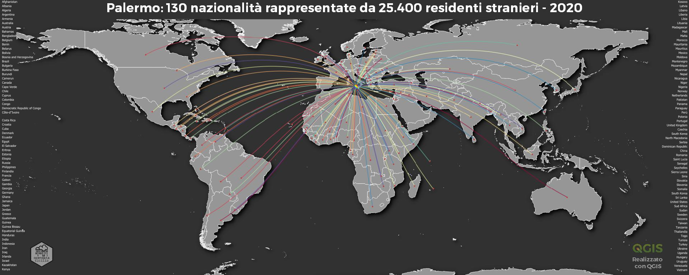

# Palermo Residenti Stranieri | 2020
<!-- ALL-CONTRIBUTORS-BADGE:START - Do not remove or modify this section -->

<!-- ALL-CONTRIBUTORS-BADGE:END -->

## Contributors ✨

Thanks goes to these wonderful people ([emoji key](https://allcontributors.org/docs/en/emoji-key)):

<!-- ALL-CONTRIBUTORS-LIST:START - Do not remove or modify this section -->
<!-- prettier-ignore-start -->
<!-- markdownlint-disable -->
<table>
  <tr>
    <td align="center"><a href="https://medium.com/@aborruso"> <b>Andrea Borruso</b></a> <a href="https://github.com/opendatasicilia/palermomeltingpot/commits?author=aborruso" title="Code">💻</a> <a href="https://github.com/opendatasicilia/palermomeltingpot/commits?author=aborruso" title="Documentation">📖</a> <a href="#data-aborruso" title="Data">🔣</a> <a href="#example-aborruso" title="Examples">💡</a> <a href="#ideas-aborruso" title="Ideas, Planning, & Feedback">🤔</a></td>
    <td align="center"><a href="http://pigrecoinfinito.com"> <b>Salvatore Fiandaca</b></a> <a href="https://github.com/opendatasicilia/palermomeltingpot/commits?author=pigreco" title="Code">💻</a> <a href="https://github.com/opendatasicilia/palermomeltingpot/commits?author=pigreco" title="Documentation">📖</a> <a href="#data-pigreco" title="Data">🔣</a> <a href="#example-pigreco" title="Examples">💡</a> <a href="#ideas-pigreco" title="Ideas, Planning, & Feedback">🤔</a></td>
  </tr>
</table>

<!-- markdownlint-restore -->
<!-- prettier-ignore-end -->

<!-- ALL-CONTRIBUTORS-LIST:END -->

This project follows the [all-contributors](https://github.com/all-contributors/all-contributors) specification. Contributions of any kind welcome!