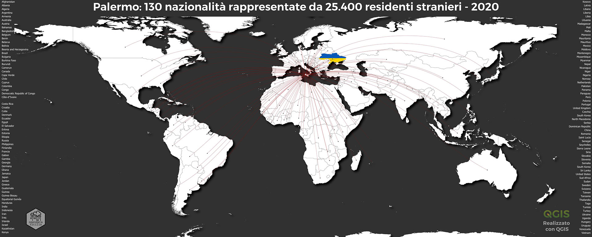

# Palermo Residenti Stranieri | 2020
<!-- ALL-CONTRIBUTORS-BADGE:START - Do not remove or modify this section -->

<!-- ALL-CONTRIBUTORS-BADGE:END -->
## Da dove vengono gli stranieri che vivono a Palermo?

Gli stranieri residenti a Palermo nel 2020 sono 25.400 e rappresentano 130 Nazionalità provenienti da 5 Continenti, oggi sono il 3,89% della popolazione totale (653.570) e lo 0.7% del totale nazionale, dato che colloca Palermo in decima posizione tra le 14 Città metropolitane per numero di residenti stranieri regolari.

- [Da dove arrivano?](https://opendatasicilia.github.io/palermomeltingpot/dove/provenienza/ "Da dove arrivano?")
- [Quanti sono?](https://opendatasicilia.github.io/palermomeltingpot/dove/quanti/ "Quanti sono?")
- [Dove vivono?](https://opendatasicilia.github.io/palermomeltingpot/dove/chi/ "Dove vivono?")
- [Chi sono?](https://opendatasicilia.github.io/palermomeltingpot/dove/dove_vivono/ "Chi sono?")
- [Qual è il rapporto stranieri/italiani nel territorio?](https://opendatasicilia.github.io/palermomeltingpot/rapporto/rapporto/ "Qual è il rapporto stranieri/italiani nel territorio?")

## Contributors ✨

Thanks goes to these wonderful people ([emoji key](https://allcontributors.org/docs/en/emoji-key)):

<!-- ALL-CONTRIBUTORS-LIST:START - Do not remove or modify this section -->
<!-- prettier-ignore-start -->
<!-- markdownlint-disable -->
<table>
  <tr>
    <td align="center"><a href="https://medium.com/@aborruso"> <b>Andrea Borruso</b></a> <a href="https://github.com/opendatasicilia/palermomeltingpot/commits?author=aborruso" title="Code">💻</a> <a href="https://github.com/opendatasicilia/palermomeltingpot/commits?author=aborruso" title="Documentation">📖</a> <a href="#data-aborruso" title="Data">🔣</a> <a href="#example-aborruso" title="Examples">💡</a> <a href="#ideas-aborruso" title="Ideas, Planning, & Feedback">🤔</a></td>
    <td align="center"><a href="http://pigrecoinfinito.com"> <b>Salvatore Fiandaca</b></a> <a href="https://github.com/opendatasicilia/palermomeltingpot/commits?author=pigreco" title="Code">💻</a> <a href="https://github.com/opendatasicilia/palermomeltingpot/commits?author=pigreco" title="Documentation">📖</a> <a href="#data-pigreco" title="Data">🔣</a> <a href="#example-pigreco" title="Examples">💡</a> <a href="#ideas-pigreco" title="Ideas, Planning, & Feedback">🤔</a></td>
  </tr>
</table>

<!-- markdownlint-restore -->
<!-- prettier-ignore-end -->

<!-- ALL-CONTRIBUTORS-LIST:END -->

This project follows the [all-contributors](https://github.com/all-contributors/all-contributors) specification. Contributions of any kind welcome!
