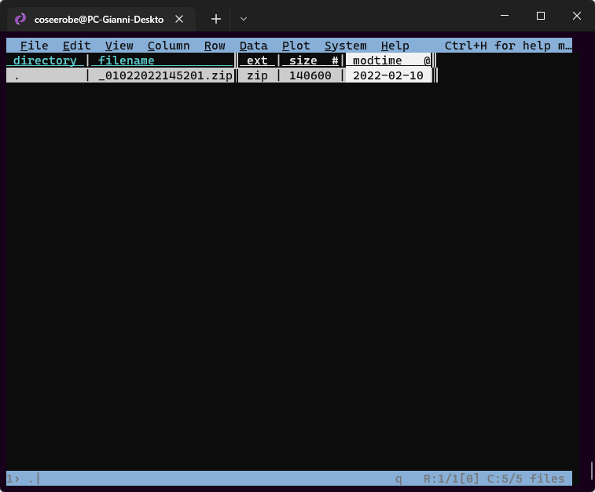
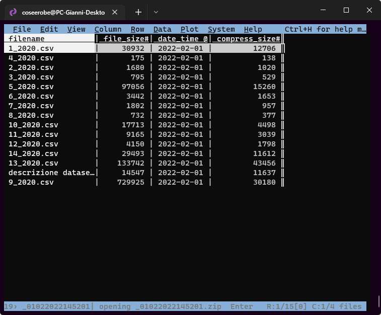
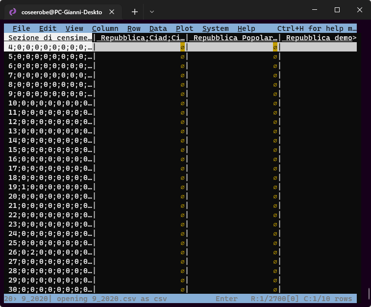
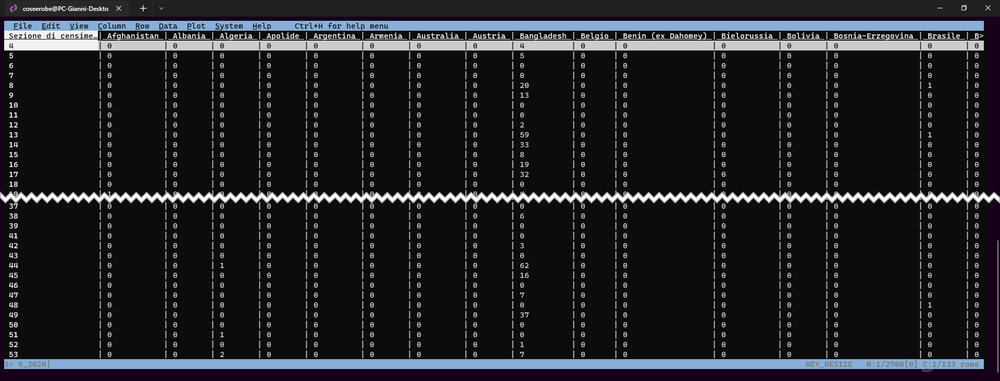

# Opendata
Grazie al *Dr. Girolamo D’Anneo*, responsabile U.O. Studi e Ricerche Statistiche e *Ciro Spataro* responsabile U.O. Transizione al Digitale, entrambi funzionari del [Comune di Palermo](https://www.comune.palermo.it/), sono stati pubblicati i **[dataset](https://opendata.comune.palermo.it/opendata-dataset.php?dataset=1304)** relativi alla popolazione residente, italiana e straniera del 2020.

Dal [portale opendata](https://opendata.comune.palermo.it/index.php) del [Comune di Palermo](https://www.comune.palermo.it/) si può scaricare un file **[zip](https://opendata.comune.palermo.it/opendata-dataset.php?dataset=1304)**, con i dataset sui residenti stranieri a Palermo nel 2020 con licenza [CC BY 4.0 IT](http://creativecommons.org/licenses/by/4.0/deed.it).

!!! Note

	Non fatevi ingannare dalla descrizione del *Formato originario della risorsa*  e dal pulsante per download, dove c'è scritto [GTFS](#){ .md-button .md-button--primary } e scaricate tranquillamente il file **[zip](https://opendata.comune.palermo.it/js/server/uploads/dataset/gtfs/_01022022145201.zip)**.  L'icona che descrive la *risorsa* non è corretta, i GTFS [(General Transit Feed Specification)](https://it.wikipedia.org/wiki/General_Transit_Feed_Specification)  è una specifica di dati che consente alle agenzie di trasporto pubblico di pubblicare i propri dati di transito in un formato che può essere utilizzato da un'ampia varietà di applicazioni software.
	
### Descrizione dei file

Il file **[zip](https://opendata.comune.palermo.it/opendata-dataset.php?dataset=1304)** contiene 14 file [csv](https://it.wikipedia.org/wiki/Comma-separated_values) con i dati sui residenti stranieri (1_2020.csv, 2_2020.csv, ecc...) e un file formato [xlsx](https://it.wikipedia.org/wiki/Microsoft_Excel) dove vengono descritti i dataset.

Dataset relativi a popolazione, stranieri e famiglie residenti a Palermo al 31/12/2020

| **File** | **Titolo** | **Descrizione** | **Fonte** | **Copertura** | **Frequenza** | **Note** |
|:---|---|---|---:|:---:|---:|---:|
| 1 | Popolazione residente a Palermo al 31/12/2020 per Sezione di censimento e cittadinanza | Il dataset contiene i dati statistici relativi alla popolazione residente a Palermo iscritta in anagrafe al 31/12/2020 suddivisa fra italiani e stranieri per Sezione di censimento | Anagrafe | 01/01/2020 - 31/12/2020 | annuale |  |
| 2 | Popolazione residente a Palermo al 31/12/2020 per Unità di primo livello e cittadinanza | Il dataset contiene i dati statistici relativi alla popolazione residente a Palermo iscritta in anagrafe al 31/12/2020 suddivisa fra italiani e stranieri per Unità di primo livello | Anagrafe | 01/01/2020 - 31/12/2020 | annuale |  |
| 3 | Popolazione residente a Palermo al 31/12/2020 per Quartiere e cittadinanza | Il dataset contiene i dati statistici relativi alla popolazione residente a Palermo iscritta in anagrafe al 31/12/2020 suddivisa fra italiani e stranieri per Quartiere | Anagrafe | 01/01/2020 - 31/12/2020 | annuale |  |
| 4 | Popolazione residente a Palermo al 31/12/2020 per Circoscrizione e cittadinanza | Il dataset contiene i dati statistici relativi alla popolazione residente a Palermo iscritta in anagrafe al 31/12/2020 suddivisa fra italiani e stranieri per Circoscrizione | Anagrafe | 01/01/2020 - 31/12/2020 | annuale |  |
| 5 | Stranieri residenti a Palermo al 31/12/2020 per Sezione di censimento e Area geopolitica | Il dataset contiene i dati statistici relativi agli stranieri residenti a Palermo iscritti in anagrafe al 31/12/2020 suddivisi per area geopolitica e Sezione di censimento | Anagrafe | 01/01/2020 - 31/12/2020 | annuale | Per le Aree geopolitiche è stata utilizzata la classificazione delle unità territoriali estere adottata dall'Istat: [istat.it/it/archivio/6747](https://www.istat.it/it/archivio/6747) |
| 6 | Stranieri residenti a Palermo al 31/12/2020 per Unità di primo livello e Area geopolitica | Il dataset contiene i dati statistici relativi agli stranieri residenti a Palermo iscritti in anagrafe al 31/12/2020 suddivisi per area geopolitica e Unità di primo livello | Anagrafe | 01/01/2020 - 31/12/2020 | annuale | Anagrafe. Per le Aree geopolitiche è stata utilizzata la classificazione delle unità territoriali estere adottata dall'Istat:[istat.it/it/archivio/6747](https://www.istat.it/it/archivio/6747) |
| 7 | Stranieri residenti a Palermo al 31/12/2020 per Quartiere e Area geopolitica | Il dataset contiene i dati statistici relativi agli stranieri residenti a Palermo iscritti in anagrafe al 31/12/2020 suddivisi per area geopolitica e Quartiere | Anagrafe | 01/01/2020 - 31/12/2020 | annuale | Per le Aree geopolitiche è stata utilizzata la classificazione delle unità territoriali estere adottata dall'Istat:[istat.it/it/archivio/6747](https://www.istat.it/it/archivio/6747) |
| 8 | Stranieri residenti a Palermo al 31/12/2020 per Circoscrizione e Area geopolitica | Il dataset contiene i dati statistici relativi agli stranieri residenti a Palermo iscritti in anagrafe al 31/12/2020 suddivisi per area geopolitica e Circoscrizione | Anagrafe | 01/01/2020 - 31/12/2020 | annuale | Per le Aree geopolitiche è stata utilizzata la classificazione delle unità territoriali estere adottata dall'Istat:[istat.it/it/archivio/6747](https://www.istat.it/it/archivio/6747) |
| 9 | Stranieri residenti a Palermo al 31/12/2020 per Sezione di censimento e cittadinanza | Il dataset contiene i dati statistici relativi agli stranieri residenti a Palermo iscritti in anagrafe al 31/12/2020 suddivisi per cittadinanza e Sezione di censimento | Anagrafe | 01/01/2020 - 31/12/2020 | annuale |  |
| 10 | Stranieri residenti a Palermo al 31/12/2020 per Unità di primo livello e cittadinanza | Il dataset contiene i dati statistici relativi agli stranieri residenti a Palermo iscritti in anagrafe al 31/12/2020 suddivisi per cittadinanza e Unità di primo livello | Anagrafe | 01/01/2020 - 31/12/2020 | annuale |  |
| 11 | Stranieri residenti a Palermo al 31/12/2020 per Quartiere e cittadinanza | Il dataset contiene i dati statistici relativi agli stranieri residenti a Palermo iscritti in anagrafe al 31/12/2020 suddivisi per cittadinanza e Quartiere | Anagrafe | 01/01/2020 - 31/12/2020 | annuale |  |
| 12 | Stranieri residenti a Palermo al 31/12/2020 per Circoscrizione e cittadinanza | Il dataset contiene i dati statistici relativi agli stranieri residenti a Palermo iscritti in anagrafe al 31/12/2020 suddivisi per cittadinanza e Circoscrizione | Anagrafe | 01/01/2020 - 31/12/2020 | annuale |  |
| 13 | Popolazione residente a Palermo al 31/12/2020 per Sezione di censimento e fasce di età | Il dataset contiene i dati statistici relativi alla popolazione residente a Palermo iscritta in anagrafe al 31/12/2020 suddivisa per Sezione di censimento e fasce quinquennali di età | Anagrafe | 01/01/2020 - 31/12/2020 | annuale |  |
| 14 | Famiglie residenti a Palermo al 31/12/2020 per Sezione di censimento e cittadinanza dell'intestatario di famiglia | Il dataset contiene i dati statistici relativi alle famiglie residenti a Palermo iscritte in anagrafe al 31/12/2020 suddivise per Sezione di censimento e cittadinanza dell'intestatario di famiglia | Anagrafe | 01/01/2020 - 31/12/2020 | annuale |  |

Come avevo già notato nel 2018, non ci sono ancora, dataset con il dati sul “genere” (maschio/femmina). Per le mappa a densità di punti è ininfluente, ma sono necessari per studiare la popolazione.  
Noto con piacere che sono stati aggiunti i dati per **Sezione di censimento**.

Nel 2018 l'identificatore geografico (blocco/poligono) era l'**UPL** (Unità di primo livello), per i dataviz è un *buon livello* di dettaglio, ma per una [mappa a dendità di punti](https://palermohub.opendatasicilia.it/stranieri_residenti_subregions_dot.html#12/38.1375/13.3475) è un *discreto livello* di dettaglio.  I punti in alcuni blocchi potrebbero trovarsi in mezzo a parchi, cimiteri, o altre aree chiaramente non residenziali all’interno di quel blocco **UPL** . 
Una rappresentazione accurata della distribuzione geografica dei residenti è possibile solo se i dati disponibili tengono conto di parchi, edifici e/o indirizzi fisici.

Vista la novità, ho scaricato i file solo per curiosità... non avevo intenzione di ripetere gli esercizi fatti nel 2018, 

- [Milano e Palermo: le mappe della distribuzione della popolazione straniera residente nel 2018](https://coseerobe.gbvitrano.it/milano-e-palermo-le-mappe-della-distribuzione-della-popolazione-straniera-residente-nel-2018.html) o sul blog [ODS](https://opendatasicilia.it/2019/06/12/palermo-popolazione-residente-per-cittadinanza-upl-quartiere-e-circoscrizione-2018/)
- [Palermo, popolazione residente per cittadinanza, UPL , Quartiere e Circoscrizione – 2018](Palermo, popolazione residente per cittadinanza, UPL , Quartiere e Circoscrizione – 2018) o sul blog [ODS](https://opendatasicilia.it/2019/05/20/milano-e-palermo-le-mappe-della-distribuzione-della-popolazione-straniera-residente-nel-2018/)

ma il titolo e la relativa descrizione del file n° 9 mi hanno spinto a quanto meno a visualizzare i dati 🙂

## Visualizzare i dati

Per velocizzare la visualizzazione, scarico il file zip e visto che [VisiData](https://www.visidata.org/) legge il contenuto dei file zip, non perdo tempo a decomprimere il file.

{width="33%"} {width="33%"} {width="33%"}
**Sorpresa...** 🙂 il delimatore dei file [csv](https://it.wikipedia.org/wiki/Comma-separated_values) non è il **comma** (la classica virgola)  `,` ma il **semicolon** `;`
di default il deliminatore per [VisiData](https://www.visidata.org/) è il **comma**, per cui basta modificarlo all'avvio per leggere correttamente i dataset. 

Per modificare il delimitatore all'avvio in Visidata basta usare `vd --csv-delimiter=";"` nella finestra del terminale.

[Guida italiana di VisiData](https://ondata.github.io/guidaVisiData/)

## Struttura del file

Uhm... 😔 il file ha una [struttura orizzontale](https://ondata.github.io/guidaPraticaPubblicazioneCSV/guida/linee_guida_pubblicazione/P04_strutture_dati_verticale_orizzontale/), la crescita orizzontale di una struttura di dati tabulari può rendere difficile la manutenzione e la creazione di visualizzazioni.   
Quando è possibile, è preferibile mettere le variabili o gli attributi dei dati nelle colonne di una tabella e aggiungere i valori corrispondenti alle osservazioni dei dati nelle righe. 
In generale, è più facile identificare le relazioni tra le variabili nelle colonne che tra le righe, ed è più facile fare confronti tra gruppi di osservazioni nelle righe che tra gruppi di colonne. [^1]

Per replicare la mappa e i dataviz fatti nel [2018](http://localhost:8000/palermomeltingpot/dati/dati/Palermo,%20popolazione%20residente%20per%20cittadinanza,%20UPL%20,%20Quartiere%20e%20Circoscrizione%20%E2%80%93%202018 "Palermo, popolazione residente per cittadinanza, UPL , Quartiere e Circoscrizione"), anche questa volta devo rielaborare il dataset 🙂

[^1]: Citazione dalla [Guida per la pubblicazione di CSV](https://ondata.github.io/guidaPraticaPubblicazioneCSV/guida/linee_guida_pubblicazione/P04_strutture_dati_verticale_orizzontale/)