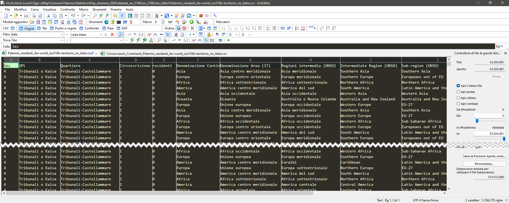

# Editor di testo per windows

Per chi non ama la **CLI** (Command Line Interface)  di [VisiData](https://www.visidata.org/)  ed usa solo windows e desidera usare uno strumento altrettanto valido[^1] per l'elaborazione di file **csv**, consiglio di usare [EmEditor](https://www.emeditor.com/), grazie ad [@aborruso](https://twitter.com/aborruso) per il suggerimento. 🙂

[^1]: EmEditor è 	un ottimo Software ma **NON** sostituisce VisiData!

<figure markdown>

  <figcaption>EmEditor | Editor di testo per windows</figcaption>
</figure>

EmEditor è un editor di testo veloce, leggero, ma estensibile e facile da usare per Windows. Sono disponibili entrambe le build native a 64 bit e a 32 bit. L'editor di testo supporta potenti macro, Unicode e file di grandi dimensioni. 

Oltre alla versione Pro di [EmEditor](https://www.emeditor.com/) c'è la versionre free. Sebbene non sia allo stesso livello di *EmEditor Professional*, **EmEditor Free** consente di eseguire la maggior parte delle attività di modifica del testo senza acquistare il prodotto. Si può usarlo in sostituzione del Blocco note con funzionalità avanzate come l'evidenziazione in colori della sintassi, la funzione di ricerca e sostituzione, il supporto Unicode e le funzionalità di stampa. Tuttavia, questa versione gratuita non include molte funzionalità offerte da EmEditor Professional, come plug-in, macro scriptabili, ecc. Per maggiori dettagli consultate [emeditor-free](https://www.emeditor.com/text-editor-features/history/emeditor-free/).

