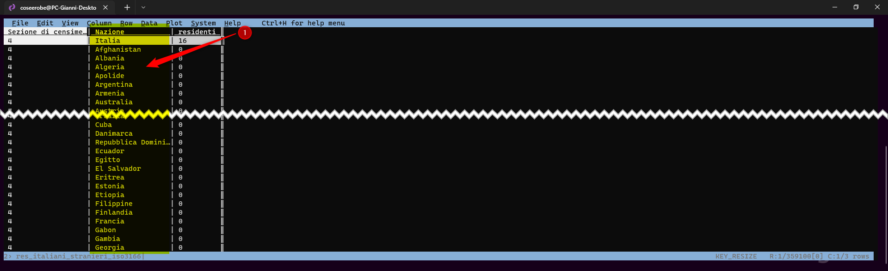

# Strutture dati verticale vs orizontale
Quando si progettano strutture di dati tabulari è consigliabile evitare la crescita orizzontale dei valori.  
Quando è possibile, è preferibile mettere le variabili o gli attributi dei dati nelle colonne di una tabella e aggiungere i valori corrispondenti alle osservazioni dei dati nelle righe. 
La crescita orizzontale di una struttura di dati tabulari può rendere difficile la manutenzione e la creazione di visualizzazioni.  
In generale, è più facile identificare le relazioni tra le variabili nelle colonne che tra le righe, ed è più facile fare confronti tra gruppi di osservazioni nelle righe che tra gruppi di colonne. [^1] ([Continua a leggere...](https://ondata.github.io/guidaPraticaPubblicazioneCSV/guida/linee_guida_pubblicazione/P04_strutture_dati_verticale_orizzontale/))

[^1]: Citazione dalla [Guida per la pubblicazione di CSV](https://ondata.github.io/guidaPraticaPubblicazioneCSV/guida/linee_guida_pubblicazione/P04_strutture_dati_verticale_orizzontale/)

### Trasformiamo la nostra tabella
Il passo successivo è modificare la [struttura orizzontale](https://ondata.github.io/guidaPraticaPubblicazioneCSV/guida/linee_guida_pubblicazione/P04_strutture_dati_verticale_orizzontale/) in verticale, con [VisiData](https://www.visidata.org/) si fa in un attimo 🙂  
Tecnicamente dobbiamo fare una **Unpivot** della nostra tabelle di base. 

Apriamo il nostro file e navighiamo sino alla colonna **Sezione di censimento**, con <kbd>Shift</kbd> + <kbd>1</kbd> ovvero <kbd>!</kbd> la rendiamo *chiave*, in questo modo non verrà ruotata/trasposta in righe. Si possono rendere *chiave* più colonne conteporaneamente.   

La tabella di base è composta da 2700 righe e 133 colonne.

<figure markdown>

  <figcaption>Quando rendiamo "chiave" una colonna il colore della stessa cambia.</figcaption>
</figure>

Con <kbd>Shift</kbd> + <kbd>m</kbd> si genera un foglio **melted**, che trasforma le colonne **non chiave** in coppie chiave/valore

In pochi secondi siamo passati dalla **struttura orizzontale** (2700 righe e 133 colonne), alla **strutturaura verticale** (356.400 righe e 3 colonne) 🙂 adesso basta salvare la nuova tabella usando i tasti <kbd>CTRL</kbd> + <kbd>s</kbd>

## Struttura verticale
Prodotto il nuovo [dataset](../../dati/rielaborazione/#struttura-verticale) a struttura verticale, possiamo *unirlo* (join) con il dataset dell'[ISTAT](https://www.istat.it/it/archivio/6747) "*Elenco codici e denominazioni delle unità territoriali estere*" e trasferire facilmente le informazioni che maggiormante ci interessano, come il **Continente** e **Area geopolitica**.

<figure markdown>
  
  <figcaption>Nuovo dataset a struttura verticale | res_italiani_stranieri_iso3166.csv</figcaption>
</figure>
Entrambi di dataset hanno una colonna in comune, anche se nominate in modo diverso, sono utili per fare le *join*
<figure markdown>
  
  <figcaption>Elenco codici e denominazioni delle unità territoriali estere | Elenco_denominazioni_Istat_full.csv</figcaption>
</figure>

La *join* si può fare in tanti modi e con tanti software, qui vediamo come farla più o meno rapidamente con:

- [Visidata](#join-con-visidata "Join con Visidata")
- [QGIS](#join-con-qgis "Join con QGIS")
- [Google sheet](#join-con-google-sheets "Join con Google sheets")

---

### Join con Visidata

Medoto per realizzare una join tra due file con [VisiData](https://www.visidata.org/)

- Aprire la prima tabella **res_italiani_stranieri_iso3166.csv** da terminale `vd res_italiani_stranieri_iso3166.csv`;
- Spostarsi nella colonna **Nazione** e renderla colonna *chiave* con <kbd>!</kbd>; [^1]
- Aprire la seconda tabella pigiando il tasto <kbd>o</kbd> e scrivendo il nome del secondo file da aprire, in questo caso **Elenco_denominazioni_Istat_full.csv**;[^2]
- Spostarsi nella colonna **Denominazione IT** e renderla colonna chiave pigiando <kbd>!</kbd>;
- Aprire il **“foglio dei fogli”** digitando <kbd>Shift</kbd> + <kbd>s</kbd> e selezionare, usando il tasto <kbd>s</kbd>, le due tabelle;
- Digitare <kbd>&</kbd> per realizzare e visualizzare la **JOIN** tra le due tabelle: scrivere <kbd>i</kbd> e selezionare **inner** e pigiare <kbd>Invio</kbd>;
- Dopo qualche secondo si vedrà la tabella con il **join**; 
- <kbd>CTRL</kbd> + <kbd>s</kbd> per salvare. 

[^1]: La JOIN in VisiData viene fatto tra colonne chiave
[^2]: Il TAB vi aiuta a completare il nome

<figure markdown>

    <figcaption>Join con Visidata | Palermo_residenti_ita+world_iso3166_lite.csv</figcaption>
</figure>

Grazie a [Totò Fiandaca](https://twitter.com/totofiandaca) per l'aiuto con la join  🙂 e grazie [Andrea Borruso](https://twitter.com/aborruso) per la [giuda in italiano](https://ondata.github.io/guidaVisiData/), fondamentale per rielaborare i dataset usati in quest'esercizio.

---

### Join con QGIS

Medoto per realizzare una join tra due file con Google sheets

- Apriamo un nuovo progetto;
- Importiamo i due dataset;
- ➊ selezioniamo il file res_italiani_stranieri_iso3166;
- ➋ Tasto dx del mouse ad aprire **Proprieta** si aprirà un poppu, cliccare su **join**; 
- ➌ Cliccare sul tasto **+**; 
- ➍ Si aprirà un nuovo popup **Aggiungi vettore da unire**; 
- ➎ Selezionare il file che si vuole unire e successivamente dai menù a tendina selezionare i campi da usare per la join;
- ➏ Selezionare i campi che si vogliono unire;
- ➐ In base alle proprioe esigenze si puo aggiungere un prefisso alle nuove colonne che vengono generate dalla jolin; 
- ➑ Cliccare su **ok** per creare la join;
- Salvare/esportare la join; 

<figure markdown>
  
    <figcaption>Join con QGIS</figcaption>
</figure>

---

### Join con Google sheets

Medoto per realizzare una join tra due file con Google sheets

- Apriamo un nuovo sheets;
- Dal menù **File** navighiamo fino ad **Impostazioni**, e nel tab *Generale* cambiamo le **impostazioni internazionali** da **Italia** a **Regno Unito**;
- Importiamo i due dataset in due fogli diversi;
- Spostiamoci nel primo sheets **res_italiani_stranieri_iso3166**;
- Selezioniamo cella **C2**;
- Usiamo questa funzione (esempio) `=IF(A2="","",VLOOKUP(B2,Elenco_denominazioni_istat!A:P,8,0))`; [^3]
- Google chiederà se la formula deve essere applicata a tutta la colonna, (compliazione automatica) cliccate su **ok** compliare a mano 359.9100 righe è dura...

[^3]: **VLOOKUP** Ricerca verticale. Ricerca una chiave in tutta la prima colonna di un intervallo e restituisce il valore di una cella specificata nella riga trovata

<figure markdown>
  
  <figcaption>Join con Google sheets</figcaption>
</figure>

Cosa fa la funzione `=IF(A2="","",VLOOKUP(B2,Elenco_denominazioni_istat!A:P,8,0))`?

Se, nella cella **A2** dello sheets **Elenco_denominazioni_istat** trova la *chiave* **B2** dello sheets **res_italiani_stranieri_iso3166** restituisce il valore della cella corrispondente nella colonna **8** dello sheets **Elenco_denominazioni_istat\	**

Per unire le altre colonne al nostro sheets, basta applicare la funzione a tutte le colonne dellì**Elenco_denominazioni_istat** che vogliano unire allo sheets **res_italiani_stranieri_iso3166**

Se vogliamo aggiungere la colonna **4** la **Denominazione Continente (IT)** la funzione è questa `=IF(A2="","",VLOOKUP(B2,Elenco_denominazioni_istat!A:P,4,0))` e così via...

---

## Dati Cartografici
Teoricamente non ho la necessità di aggiungere in questo nuovo dataset anche i campi con le informazioni sulle **UPL**, **Quartieri** e **Circoscrizioni**. Questa join posso farla direttamente in QGIS, per elaborare la mappa a dendità di punti, o con Tableau e flourish.studio per elaborare i dataviz, utilizzando la colonna **Sezione di censimento** per la *join*.

Visto che [VisiData](https://www.visidata.org/) rende l'operazione semplissima, perchè non farla...? 🙂

Per questa nuova *join*, ho usato il nuovo dataset realizzato in predenza e il dataset sul territorio di Palermo ([già elaborato per la base cartografica](https://coseerobe.gbvitrano.it/circoscrizioni-palermo-censimento-istat-2011.html)), entrambi hanno in comune la colonna delle *Sezioni censuarie dell' ISTAT*

<figure markdown>
  
  <figcaption>Join con i dati sul territorio, aggiunte le colonne UPL, Quartiere e Circoscrizione | Palermo_residenti_ita+world_iso3166+territorio.csv</figcaption>
</figure>

Queste nuove colonne possono tornare utili per produrre dataset di sintesi o di filtraggio con le query.  
Esempio:

- Popolazione residente per UPL | italiani e stranieri (per Continente, Area Geopolitita, Nazione ecc...)
- Popolazione residente per Quartieri | italiani e stranieri (per Continente, Area Geopolitita, Nazione ecc...)
- Popolazione residente per Circoscizioni | italiani e stranieri (per Continente, Area Geopolitita, Nazione ecc...)
- Le principali nazionalità presenti e dove.