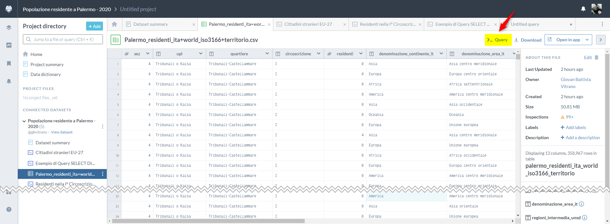
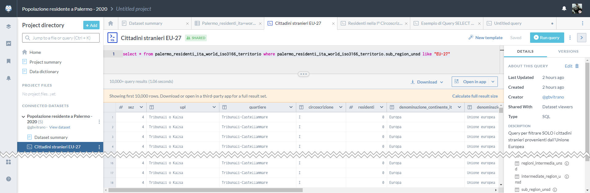
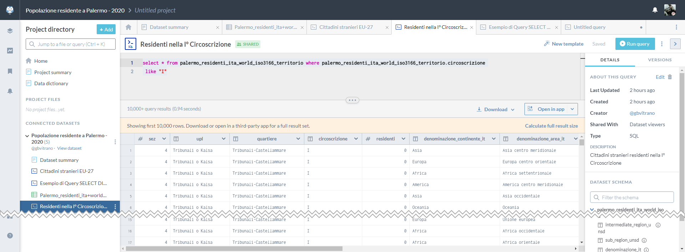
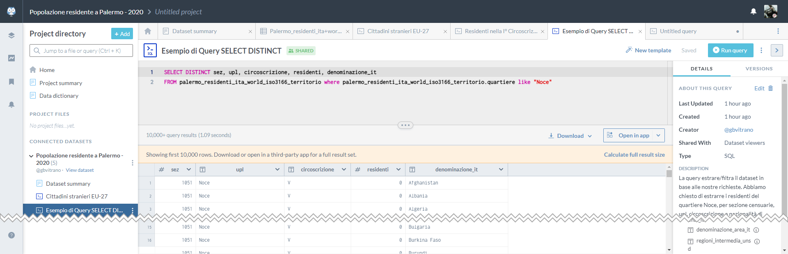
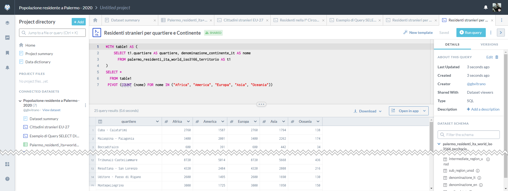
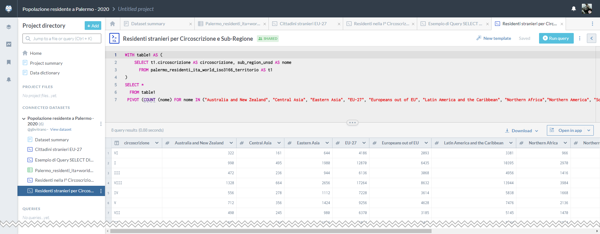

# Query e tabelle Pivot con Data.world

### Condivisione del dataset
Il dataset rielaborato sulla popolazione straniera residente a Palermo nel 2020 è stato condiviso su **[Data.Worls](https://data.world/gbvitrano/popolazione-residente-a-palermo-2020)** | **[Popolazione residente a Palermo - 2020](https://data.world/gbvitrano/popolazione-residente-a-palermo-2020)** [:fontawesome-solid-expand:](https://data.world/gbvitrano/popolazione-residente-a-palermo-2020 "Apri a schermo intero")

**Cos'è data.world...?** <br>
*[data.world, è uno YouTube per i dati](https://medium.com/tantotanto/data-world-uno-youtube-per-i-dati-6f77d3176868)* come ci spiega [Andrea Borruso](https://twitter.com/aborruso) su [medium](https://medium.com/tantotanto/data-world-uno-youtube-per-i-dati-6f77d3176868).

<figure markdown>
[](https://data.world/gbvitrano/popolazione-residente-a-palermo-2020)
  <figcaption>Data.World dataset Popolazione residente a Palermo - 2020</figcaption>
</figure>

In **[Data.Worls](https://data.world/gbvitrano/popolazione-residente-a-palermo-2020)** è disponibile un *query editor* con cui è possibile interrogare tutti i dataset pubblicati su data.world e metterli anche in correlazione tra loro. Qui la **[guida](https://docs.data.world/documentation/sql/concepts/advanced/PIVOT.html)**

### Query e Pivot con Data.World
**[Query](https://it.wikipedia.org/wiki/Query)** in italiano significa: domanda, interrogazione, richiesta. Una *query* di ricerca è un insieme di parole chiave con cui un utente esprime il suo intento di ricerca (Search Intent). Ogni volta che scriviamo sulla barra di ricerca di un qualsiasi *motore di ricerca* scriviamo una **query database**, ovvero un’interrogazione che viene fatta ad un database di contenuti.

Una tabella **[Pivot](https://it.wikipedia.org/wiki/Tabella_pivot)** è uno strumento analitico e di reporting necessario alla creazione di tabelle riassuntive. Uno dei fini principali di queste tabelle è l’organizzazione di dati complessi tramite una scelta opportuna dei campi e degli elementi che devono comporla.

---

### Esempio 1️⃣  SELECT * FROM
Filtrare in tutto il dataset **SOLO** cittadini stranieri di provenienza dai Paesi dell'Unione Europea **EU-27**

```
select * from palermo_residenti_ita_world_iso3166_territorio where palermo_residenti_ita_world_iso3166_territorio.sub_region_unsd like "EU-27"
```

<figure markdown>
[](https://data.world/gbvitrano/popolazione-residente-a-palermo-2020/workspace/query?queryid=6117f73f-a46f-44c0-b620-f327f1191379)
  <figcaption>Data.World | query Cittadini stranieri EU-27</figcaption>
</figure>
---
### Esempio 2️⃣  SELECT * FROM
Filtrare in tutto il dataset **SOLO** cittadini stranieri residenti nella **I°** Circoscrizione

```
select * from palermo_residenti_ita_world_iso3166_territorio where palermo_residenti_ita_world_iso3166_territorio.circoscrizione
 like "I"
```
<figure markdown>
[](https://data.world/gbvitrano/popolazione-residente-a-palermo-2020/workspace/query?queryid=6bb058b6-eb9f-41e0-a678-bb211e92ead4)
  <figcaption>Data.World | quey Residenti nella I° Circoscrizione</figcaption>
</figure>
---
### Esempio 3️⃣  SELECT DISTINCT
La query estrare/filtra il dataset in base alle nostre richieste.
Abbiamo chiesto di estrarre i residenti del quartiere **Noce**, per *sezioni censuarie, upl, circoscrizione e nazionalità di provenienza*

```
SELECT DISTINCT sez, upl, circoscrizione, residenti, denominazione_it
FROM palermo_residenti_ita_world_iso3166_territorio where palermo_residenti_ita_world_iso3166_territorio.quartiere like "Noce"
```
<figure markdown>
[](https://data.world/gbvitrano/popolazione-residente-a-palermo-2020/workspace/query?queryid=5ff732e4-80d9-442d-89a4-da560a2ffa98)
  <figcaption>Data.World Esempio di Query SELECT DISTINCT</figcaption>
</figure>
---

### Esempio 4️⃣  PIVOT
Residenti stranieri per Circoscrizione e Sub-Regione

```
WITH table1 AS (
    SELECT t1.circoscrizione AS circoscrizione, sub_region_unsd AS nome
      FROM palermo_residenti_ita_world_iso3166_territorio AS t1
)
SELECT *
  FROM table1
 PIVOT (COUNT (nome) FOR nome IN ("Australia and New Zealand", "Central Asia", "Eastern Asia", "EU-27", "Europeans out of EU", "Latin America and the Caribbean", "Northern Africa","Northern America", "South-eastern Asia", "Southern Asia", "Sub-Saharan Africa", "Western Asia" ))
```

<figure markdown>
[](https://data.world/gbvitrano/popolazione-residente-a-palermo-2020/workspace/query?queryid=94154b8b-e779-4ba4-befb-40dd1131f7cc)
  <figcaption>Data.World Esempio di Query per tabella Pivot</figcaption>
</figure>

---

### Esempio 5️⃣  PIVOT
Residenti stranieri per quartiere e Continente

```
WITH table1 AS (
    SELECT t1.quartiere AS quartiere, denominazione_continente_it AS nome
      FROM palermo_residenti_ita_world_iso3166_territorio AS t1
)
SELECT *
  FROM table1
 PIVOT (COUNT (nome) FOR nome IN ("Africa", "America", "Europa", "Asia", "Oceania"))
```

<figure markdown>
[](https://data.world/gbvitrano/popolazione-residente-a-palermo-2020/workspace/query?queryid=93243c8a-e78b-4f04-a048-599e8bf5cda4)
  <figcaption>Data.World Esempio di Query per tabella Pivot</figcaption>
</figure>

Grazie a [Totò Fiandaca](https://twitter.com/totofiandaca) e  [Andrea Borruso](https://twitter.com/aborruso) per gli esempi  4️⃣  e 5️⃣  Altri esempi di query con data.world consiglio questa [ricetta](https://tansignari.opendatasicilia.it/ricette/query/creare_tabella_pivot/) su [tansignari.opendatasicilia.it](https://tansignari.opendatasicilia.it/)