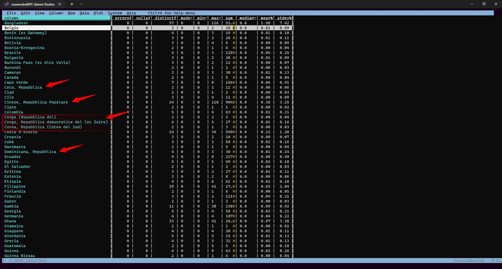
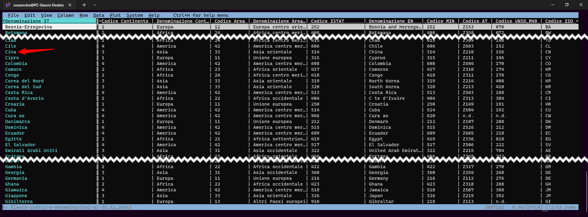
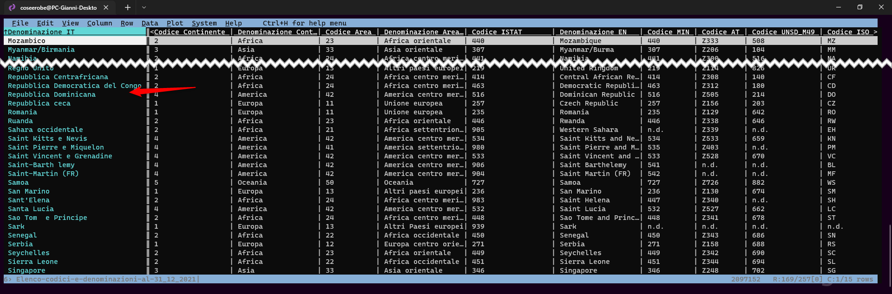
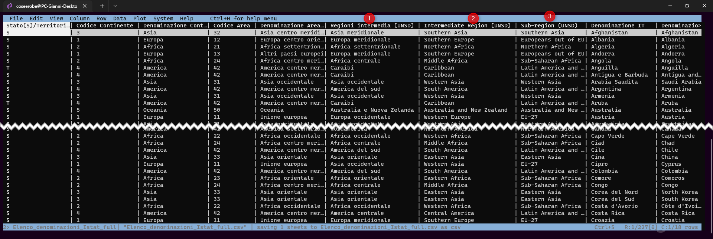
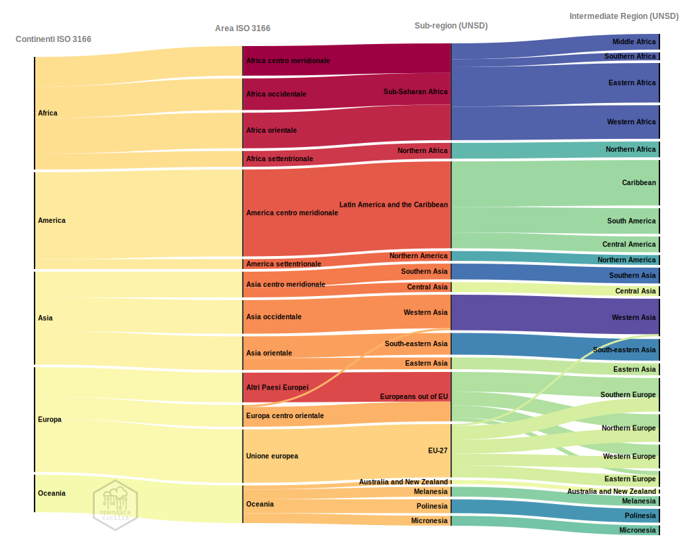

# Rielaborazione dataset

Per elaborare la mappa a [densità di punti](../dove/one-person-one-dot.md) e i dataviz, ho usato solo il file n° **9**, *Stranieri residenti a Palermo al 31/12/2020 per Sezione di censimento e cittadinanza*, scelto proprio perchè contiene le informazione sulla cittadinanza distribuita nelle [sezioni censuarie](http://www.istat.it/it/archivio/104317) dell’ISTAT, che unite alla base [cartografica](https://coseerobe.gbvitrano.it/circoscrizioni-palermo-censimento-istat-2011.html) rielaborata qualche anno fa con [QGIS](https://www.qgis.org/it/site/) mi consente di ricostruire i dati nelle **UPL** (Unità di primo livello), **Quartieri** e **Circoscrizioni**.
 
Rielaboro il dataset, perchè il tipo di struttura ([orizzontale](https://ondata.github.io/guidaPraticaPubblicazioneCSV/guida/linee_guida_pubblicazione/P04_strutture_dati_verticale_orizzontale/)) usata nei vari dataset pubblicati dal [Comune](https://opendata.comune.palermo.it/opendata-dataset.php?dataset=1304),  non mi consente di produrre le elaborazioni che mi sono prefissato.

## Riepilogo globale 

Prima di iniziare a giocare con i dati, provo ad avere una visione completa dell'intera tabella.

- Quante sono le sezione censuarie dove vivono gli stranieri?
- Quante Nazionalità sono presenti a Palermo? 
- Ci sono errori?
- Ci sono spazi vuoti?
- Ecc...

Avere le risposte al volo con [VisiData](https://www.visidata.org/) è semplicissimo.   Basta usare la combinazione dei tasti [<kbd>Shift</kbd> + <kbd>I</kbd>](https://ondata.github.io/guidaVisiData/lavorareColonne/#impostare-il-tipo-di-campo) per conoscere le statistiche del file, subito dopo aver definito i [campi](https://ondata.github.io/guidaVisiData/lavorareColonne/#impostare-il-tipo-di-campo)

Oltre alle statistiche, saltano all'occhio alcuni nomi di Nazioni come per esempio:

- Cinese, Repubblica Popolare;
- Congo, Repubblica democratica;
- Congo (Repubblica del),
- Dominicana, Repubblica;
- Ecc...

Visto che per le Aree geopolitiche è stata utilizzata la [classificazione delle unità territoriali estere adottata dall'Istat](https://www.istat.it/it/archivio/6747), verifico le denominazioni delle Nazioni.

### ISTAT Elenco codici e denominazioni

Scarico i file dall'[ISTAT](https://www.istat.it/it/archivio/6747) e sempre utilizzando sempre [VisiData](https://www.visidata.org/) apro il file  **Elenco-codici-e-denominazioni-al-31_12_2021.csv**

Come pensavo, nella tabella dell'ISTAT i nomi della Nazioni sono riportati secondo la norma ISO 3166

## Ottimizzazione

Con un pò di pazienza rinomino, secondo le specifiche ISTAT, tutte quelle Nazioni con il *nome* fuori specifica.

<figure markdown>

  <figcaption>Tabella rielaborata | Denominazione Nazioni a norma ISO 3166</figcaption>
</figure>

???+ note

     **La tabella rielaborata ha mantenuto la struttura orizzontale.** 
	

**E' necessario normalizzare il *nome* delle Nazioni?**

- Si, se per un determinato tema esistono Regole/Norme/Ontologie, perchè non usarle correttamente?
- Normalizzare i **nomi**, mi permetterà di fare delle **Join** tra file con la stessa colonna *chiave* in comune.
- Normalizzare i **nomi** delle Nazioni secondo la norma ISO 3166 e UNSD faciliterà la creazione di mappe con software come [Flourish](https://app.flourish.studio/), [Datawrapper](https://www.datawrapper.de/), [Tableau Public](https://public.tableau.com/s/) e [Google Data Studio](https://datastudio.google.com/) che adottano le norme ISO per riconoscere e geolocalizzare un Continente o una Nazione.

Sul sito [World Bank Official Boundaries](https://datacatalog.worldbank.org/search/dataset/0038272) sono disponibili confini internazionali, aree contese, coste e laghi, in formato ESRI GeoDatabase, in GeoJSON, a shapefile e gli endpoint API per le mappe interattive.

## Denominazione Nazioni a norma ISO 3166 e UNSD

All'elenco delle Denominazione Nazioni norma [ISO 3166](https://www.iso.org/iso-3166-country-codes.html) ho aggiunto le denominazione usate dall'[UNSD](https://it.wikipedia.org/wiki/Geoschema_delle_Nazioni_Unite/)[^1].

L'[UNSD](https://it.wikipedia.org/wiki/Geoschema_delle_Nazioni_Unite) distingue tre livelli più il paese: Region (regione o continente), Sub-region (sottoregione), Intermediate Region (regione intermedia) e Country or Area (nazione o area), ad esempio: Africa (region), Sub-Saharan Africa (sub-region), Southern Africa (intermediate region) e Botswana (country or area). 

Per questo esercizio, preferisco usare le denominazioni [UNSD](https://it.wikipedia.org/wiki/Geoschema_delle_Nazioni_Unite/)).   
Sempre nella colonna **Sub-region**, ho riclassificato gli Stati Europei in **EU-27** (Stati membri dell'Unione) e **Europeans out of EU** (Stati fuori dall'Unione).

[^1]: **UNSD**, United Nations Statistics Division anche UNSC (*Commissione statistica delle Nazioni Unite*) è una commissione del Consiglio economico e sociale delle Nazioni Unite.
Ha il compito di occuparsi di tutte le varie statistiche demografiche, economiche e commerciali necessarie alle agenzie ONU e di standardizzare i nomi delle località geografiche nelle varie lingue; provvede anche ad organizzare la Conferenza delle Nazioni Unite sulla standardizzazione dei nomi geografici.

<figure markdown>

  <figcaption>Tabella rielaborata | Denominazione Nazioni a norma ISO 3166 e UNSD</figcaption>
</figure>

<figure markdown>

  <figcaption>Geoschema | Denominazione Nazioni a norma ISO 3166 e UNSD</figcaption>
</figure>

<body> 

<object class='tableauViz'  style='display:none;'><param name='host_url' value='https%3A%2F%2Fpublic.tableau.com%2F' /> <param name='embed_code_version' value='3' /> <param name='site_root' value='' /><param name='name' value='Geoschema_02&#47;ISO3166' /><param name='tabs' value='no' /><param name='toolbar' value='yes' /><param name='animate_transition' value='yes' /><param name='display_static_image' value='yes' /><param name='display_spinner' value='yes' /><param name='display_overlay' value='yes' /><param name='display_count' value='yes' /><param name='language' value='it-IT' /><param name='filter' value='publish=yes' /></object>
                
</body> 
