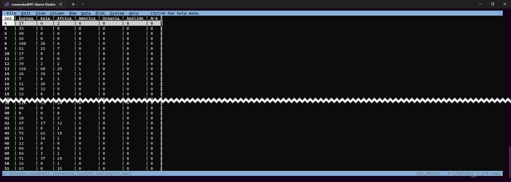
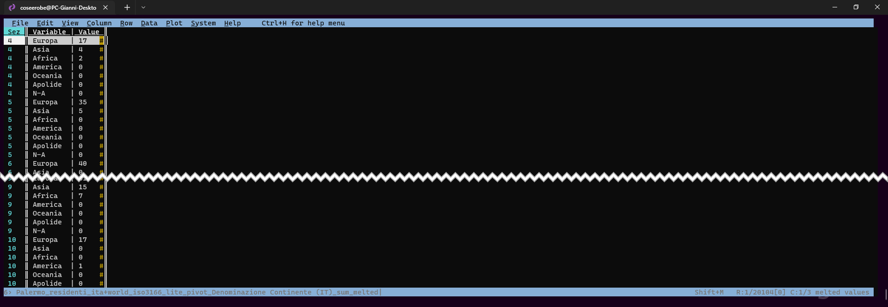
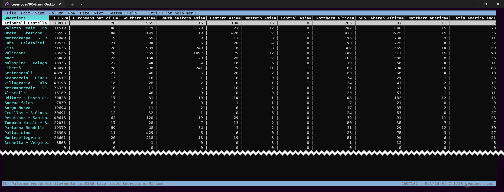
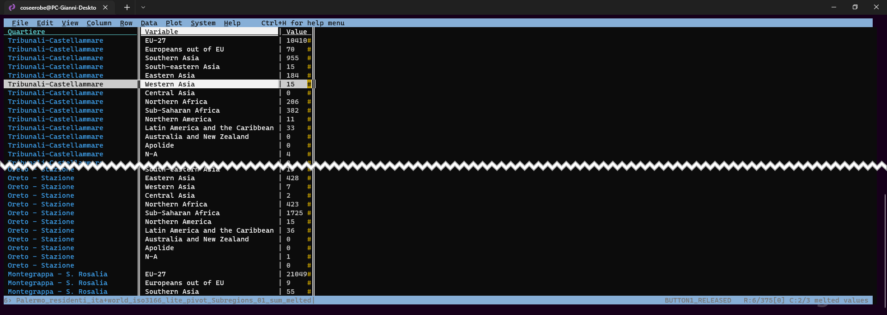
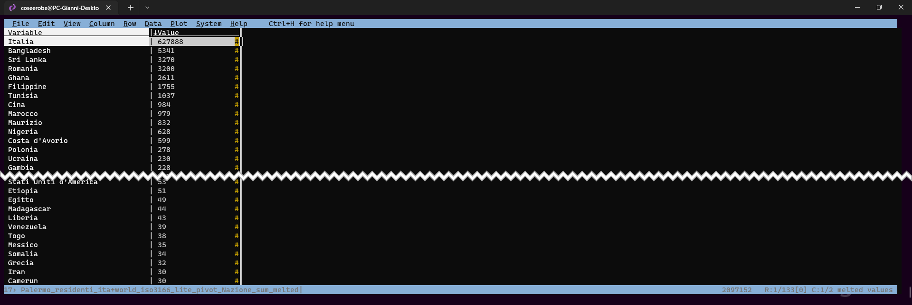

# Tabella Pivot con VisiData
Una tabella [pivot](https://it.wikipedia.org/wiki/Tabella_pivot) è uno strumento analitico e di reporting necessario alla creazione di tabelle riassuntive. Uno dei fini principali di queste tabelle è l'organizzazione di dati, tramite una scelta opportuna dei campi e degli elementi che devono comporla. ([fonte](https://it.wikipedia.org/wiki/Tabella_pivot))

### Esempio 1️⃣  PIVOT
Generare una tabella pivot dei residenti per **sezione censuaria** suddivisi per **Continente**

<figure markdown>

  <figcaption>Tabella base | Palermo_residenti_ita+world_iso3166+territorio.csv</figcaption>
</figure>

- Aprire la tabella **Palermo_residenti_ita+world_iso3166+territorio.csv** da terminale con   `vd Palermo_residenti_ita+world_iso3166+territorio.csv`
- Spostarsi nella colonna **Sez** e renderla colonna *chiave* pigiando <kbd>!</kbd>; 
- Spostarsi nella colonna **Residenti** e si imposta a numero intero, pigiando <kbd>#</kbd>; 
- Si pigia <kbd>+</kbd>, poi in **basso a sinistra nel prompt** si scrive **sum** e infine si dà <kbd>INVIO</kbd>;
- Si naviga fino colonna **Denominazione Continente (IT)** <kbd>Shift</kbd> + <kbd>w</kbd>  FATTO! 

<figure markdown>
  
  <figcaption> Residenti per sezione censuaria suddivisi per Continente | Struttura orizzontale</figcaption>
</figure>

E' stata generata una tabella a struttura orizzontale, se occorre, con un ulteriore passaggio <kbd>Shift</kbd> + <kbd>m</kbd> modifichiamo la struttura. 

<figure markdown>
  
  <figcaption> Residenti per sezione censuaria suddivisi per Continente | Struttura verticale</figcaption>
</figure>
---
### Esempio 2️⃣  PIVOT
Generare una tabella pivot dei residenti per **Quartieri** suddivisi per **Sub-Regione**

- Aprire la tabella **Palermo_residenti_ita+world_iso3166+territorio.csv** da terminale con    `vd Palermo_residenti_ita+world_iso3166+territorio.csv`
- Spostarsi nella colonna **Quartiere** e renderla colonna *chiave* pigiando <kbd>!</kbd>; 
- Spostarsi nella colonna **Residenti** e si imposta a numero intero, pigiando <kbd>#</kbd>; 
- Si pigia <kbd>+</kbd>, poi in **basso a sinistra nel prompt** si scrive **sum** e infine si dà <kbd>INVIO</kbd>;
- Si naviga fino colonna **Subregion** <kbd>Shift</kbd> + <kbd>w</kbd>  FATTO! 

<figure markdown>
  
  <figcaption> Residenti per Quartieri suddivisi per Sub-Regione | Struttura orizzontale</figcaption>
</figure>

Se occorre, con un ulteriore passaggio <kbd>Shift</kbd> + <kbd>m</kbd> modifichiamo la struttura.

<figure markdown>
  
  <figcaption> Residenti per Quartieri suddivisi per Sub-Regione | Struttura verticale</figcaption>
</figure>
---
### Esempio 3️⃣  SUM
Calcolo al volo della popolazione residente per nazionalità in ordine decrescente

- Aprire la tabella **Palermo_residenti_ita+world_iso3166_lite.csv** da terminale con `vd Palermo_residenti_ita+world_iso3166_lite.csv`
- Spostarsi nella colonna **Residenti** e si imposta a numero intero, pigiando <kbd>#</kbd>;
- Si pigia <kbd>+</kbd>, poi in **basso a sinistra nel prompt** si scrive **sum** e infine si dà <kbd>INVIO</kbd>;
- Spostarsi nella colonna **Nazione** <kbd>Shift</kbd> + <kbd>w</kbd>;
- <kbd>Shift</kbd> + <kbd>m</kbd>; 
- Spostarsi nells colonna **Value** e pigiare <kbd>]</kbd>; FATTO!

<figure markdown>
  
  <figcaption>Residenti per nazionalità</figcaption>
</figure>

## Tabella Pivot con Tableau
[Guida Tableau | Trasformare dati tramite pivot](https://help.tableau.com/current/prep/it-it/prep_pivot.htm)