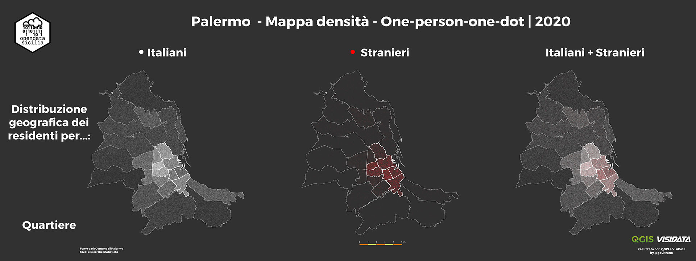

# Da vivono gli stranieri a Palermo?

## Quartieri con maggior presenza

I dataviz in basso permettono una lettura semplice e rapida dei dati, sia la <em>mappa a densità</em> che i  grafici <em>sunburst</em> e <em>treemap</em> mostrano quanti resisdenti stranieri vivono nei quartieri della città.   A colpo d’occhio vediamo qual’è la circoscrizone/quartiere con la maggior presenza di residenti stranieri per Area Geopolitica di provenienza.  

### Tabella dati
<body> 
<table width="100%" style="border: 1px solid #2a2a2a" align="center" cellpadding="0" cellspacing="0">
  <tbody>
    <tr style="border: 1px solid #2a2a2a">
      <td bgcolor="#2A2A2A" style="border: 1px solid #2a2a2a"><strong>Tab. 1</strong></td>
      <td bgcolor="#2A2A2A"  style="border: 1px solid #2a2a2a"><strong>&nbsp;</strong></td>
      <td bgcolor="#2a2a2a" style="border: 1px solid #2a2a2a"><strong>Tab. 2</strong></td>
    </tr>
    <tr>
      <td bgcolor="#2a2a2a" style="border: 1px solid #2a2a2a"><table align="center">
        <tr>
          <td align="left" bgcolor="#ffd400" ><strong style="color:#2a2a2a">Circoscrizione</strong></td>
          <td align="left" bgcolor="#ffd400" ><strong style="color:#2a2a2a">Quartiere</strong></td>
          <td align="right" bgcolor="#ffd400" ><strong style="color:#2a2a2a">Residenti</strong></td>
          <td align="right" bgcolor="#ffd400" ><strong style="color:#2a2a2a">%</strong></td>
        </tr>
        <tr>
          <td align="left">I</td>
          <td align="left">Palazzo Reale - Monte di Pietà</td>
          <td align="right">2841</td>
          <td align="right">11,17</td>
        </tr>
        <tr>
          <td align="left">I</td>
          <td align="left">Tribunali-Castellammare</td>
          <td align="right">2147</td>
          <td align="right">8,44</td>
        </tr>
        <tr>
          <td align="left">II</td>
          <td align="left">Brancaccio - Ciaculli</td>
          <td align="right">147</td>
          <td align="right">0,58</td>
        </tr>
        <tr>
          <td align="left">II</td>
          <td align="left">Settecannoli</td>
          <td align="right">307</td>
          <td align="right">1,21</td>
        </tr>
        <tr>
          <td align="left">III</td>
          <td align="left">Oreto - Stazione</td>
          <td align="right">4257</td>
          <td align="right">16,73</td>
        </tr>
        <tr>
          <td align="left">III</td>
          <td align="left">Villagrazia - Falsomiele</td>
          <td align="right">217</td>
          <td align="right">0,85</td>
        </tr>
        <tr>
          <td align="left">IV</td>
          <td align="left">Altarello</td>
          <td align="right">207</td>
          <td align="right">0,81</td>
        </tr>
        <tr>
          <td align="left">IV</td>
          <td align="left">Boccadifalco</td>
          <td align="right">75</td>
          <td align="right">0,29</td>
        </tr>
        <tr>
          <td align="left">IV</td>
          <td align="left">Cuba - Calatafimi</td>
          <td align="right">593</td>
          <td align="right">2,33</td>
        </tr>
        <tr>
          <td align="left">IV</td>
          <td align="left">Mezzomonreale - Villa Tasca</td>
          <td align="right">268</td>
          <td align="right">1,05</td>
        </tr>
        <tr>
          <td align="left">IV</td>
          <td align="left">Montegrappa - S. Rosalia</td>
          <td align="right">530</td>
          <td align="right">2,08</td>
        </tr>
        <tr>
          <td align="left">V</td>
          <td align="left">Borgo Nuovo</td>
          <td align="right">171</td>
          <td align="right">0,67</td>
        </tr>
        <tr>
          <td align="left">V</td>
          <td align="left">Noce</td>
          <td align="right">2226</td>
          <td align="right">8,75</td>
        </tr>
      </table></td>
      <td bgcolor="#2a2a2a" style="border: 1px solid #2a2a2a">&nbsp;</td>
      <td bgcolor="#2a2a2a" style="border: 1px solid #2a2a2a"><table align="center">
        <tr>
          <td align="left" bgcolor="#ffd400"><strong style="color:#2a2a2a">Circoscrizione</strong></td>
          <td align="left" bgcolor="#ffd400"><strong style="color:#2a2a2a">Quartiere</strong></td>
          <td bgcolor="#ffd400"><strong style="color:#2a2a2a">Residenti</strong></td>
          <td bgcolor="#ffd400"><strong style="color:#2a2a2a">%</strong></td>
        </tr>
        <tr>
          <td align="left">V</td>
          <td align="left">Uditore - Passo di Rigano</td>
          <td>511</td>
          <td>2,01</td>
        </tr>
        <tr>
          <td align="left">V</td>
          <td align="left">Zisa</td>
          <td>2511</td>
          <td>9,87</td>
        </tr>
        <tr>
          <td align="left">VI</td>
          <td align="left">Cruillas - S.Giovanni Apostolo</td>
          <td>239</td>
          <td>0,94</td>
        </tr>
        <tr>
          <td align="left">VI</td>
          <td align="left">Resuttana - San Lorenzo</td>
          <td>676</td>
          <td>2,66</td>
        </tr>
        <tr>
          <td align="left">VII</td>
          <td align="left">Arenella - Vergine Maria</td>
          <td>47</td>
          <td>0,18</td>
        </tr>
        <tr>
          <td align="left">VII</td>
          <td align="left">Pallavicino</td>
          <td>660</td>
          <td>2,59</td>
        </tr>
        <tr>
          <td align="left">VII</td>
          <td align="left">Partanna Mondello</td>
          <td>415</td>
          <td>1,63</td>
        </tr>
        <tr>
          <td align="left">VII</td>
          <td align="left">Tommaso Natale - Sferracavallo</td>
          <td>282</td>
          <td>1,11</td>
        </tr>
        <tr>
          <td align="left">VIII</td>
          <td align="left">Libertà</td>
          <td>1504</td>
          <td>5,91</td>
        </tr>
        <tr>
          <td align="left">VIII</td>
          <td align="left">Malaspina - Palagonia</td>
          <td>340</td>
          <td>1,34</td>
        </tr>
        <tr>
          <td align="left">VIII</td>
          <td align="left">Montepellegrino</td>
          <td>609</td>
          <td>2,39</td>
        </tr>
        <tr>
          <td align="left">VIII</td>
          <td align="left">Politeama</td>
          <td>3551</td>
          <td>13,96</td>
        </tr>
      </table></td>
    </tr>
  </tbody>
</table>
</table>
</body>

</body> 

### Mappa densità
<body> 

</body> 

### Hierarchy Sunburst
I dati possono essere filtrati per ogni singola Circoscrizione.
<body> 

</body> 

Demo del grafico sunburst/treemap, entrambi hanno tre livelli, Circoscrizione, Quartiere e Area Geopolitica di provenienza.

{width="32.9%"} {width="32.9%"} {width="32.9%"}

---

Dalle mappe e dai grafici emerge che nel centro stroico (quartieri **Palazzo Reale** 2.843– **Monte di Pietà** e **Tribunali** 2.151) c’è la maggior presenza di residenti stranieri con 4.994 residenti pari al 19.62%  , seguono i quartieri di:

- Oreto Stazione 4.261 residenti – 16.75%;
- Politeama 3.556 residenti – 13.98%;
- Zisa 2.511 residenti – 9.87%;
- Noce  2.226 residenti – 8.75%;
- Libertà  1.505 residenti – 5.91%.

che da soli ospitano **19.053** residenti, pari al **74.87%** del totale dei residenti (25.400), confermando l'[analisi](https://coseerobe.gbvitrano.it/palermo-popolazione-residente-per-cittadinanza-upl-quartiere-e-circoscrizione-2018.html) fatta nel 2018

---

### Residenti per Quartiere e Nazionalità

<body> 

<object class='tableauViz'  style='display:none;'><param name='host_url' value='https%3A%2F%2Fpublic.tableau.com%2F' /> <param name='embed_code_version' value='3' /> <param name='site_root' value='' /><param name='name' value='Palermo_residenti_stranieri_2020&#47;Residenti_Quartieri' /><param name='tabs' value='no' /><param name='toolbar' value='yes' /><param name='animate_transition' value='yes' /><param name='display_static_image' value='yes' /><param name='display_spinner' value='yes' /><param name='display_overlay' value='yes' /><param name='display_count' value='yes' /><param name='language' value='it-IT' /><param name='filter' value='publish=yes' /></object>
                
</body> 

---

### Tabella dati
<body> 

<object class='tableauViz'  style='display:none;'><param name='host_url' value='https%3A%2F%2Fpublic.tableau.com%2F' /> <param name='embed_code_version' value='3' /> <param name='site_root' value='' /><param name='name' value='Palermo_residenti_stranieri_2020_geoschema2&#47;Geoschema' /><param name='tabs' value='no' /><param name='toolbar' value='yes' /><param name='animate_transition' value='yes' /><param name='display_static_image' value='yes' /><param name='display_spinner' value='yes' /><param name='display_overlay' value='yes' /><param name='display_count' value='yes' /><param name='language' value='it-IT' /><param name='filter' value='publish=yes' /></object>
                
</body>
---

## Le 4 principali nazionalità straniere

I cittadini **bangladesi** *20,99%*, **singalesi** *12.85%*, **romeni** *12.58%* e **ghanesi** *10,26%* da soli costituiscono più della metà (*56,68%*) di tutti gli stranieri residenti a Palermo.

<body> 

<object class='tableauViz'  style='display:none;'><param name='host_url' value='https%3A%2F%2Fpublic.tableau.com%2F' /> <param name='embed_code_version' value='3' /> <param name='site_root' value='' /><param name='name' value='Palermo_residenti_stranieri_2020_4nazioni&#47;Residenti_Quartieri' /><param name='tabs' value='no' /><param name='toolbar' value='yes' /><param name='animate_transition' value='yes' /><param name='display_static_image' value='yes' /><param name='display_spinner' value='yes' /><param name='display_overlay' value='yes' /><param name='display_count' value='yes' /><param name='language' value='it-IT' /><param name='filter' value='publish=yes' /></object>
                
</body> 