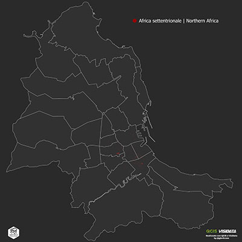
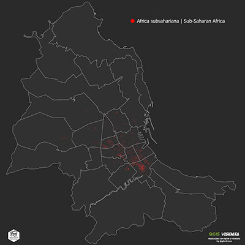
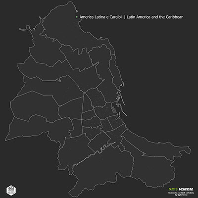
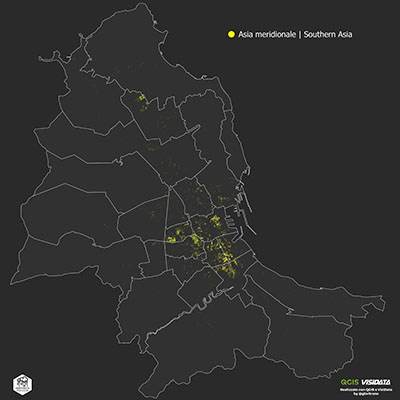
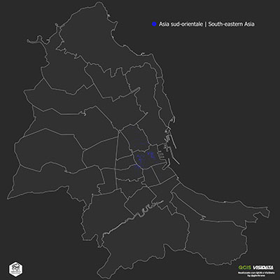
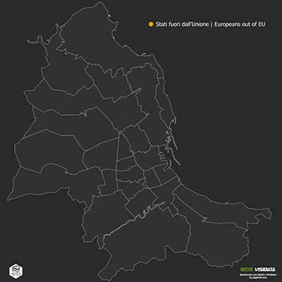
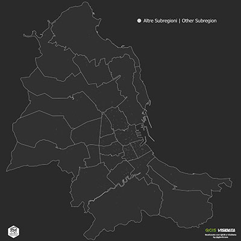
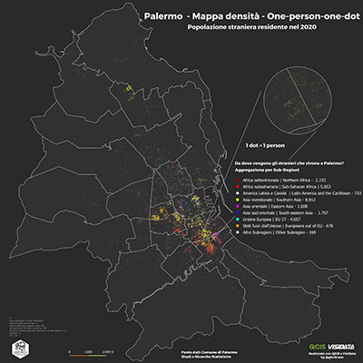

# Palermo Melting Pot [^1]
Nel 2020 a Palermo erano rappresentate 130 nazionalità, se consideriamo che in tutto il mondo ci sono poco più di 200 nazionalità, questo fa di Palermo una città [multietnica](https://it.wikipedia.org/wiki/Societ%C3%A0_multietnica) e multirazziale. Garantire l'inclusione sociale dei migranti è essenziale per lo sviluppo di una società culturalmente e socialmente ricca.

[^1]: Melting pot (tradotto come "crogiolo", "calderone") è l'espressione che si usa per indicare quel tipo di società che vive e permette la commistione di individui di origini, religioni e culture diverse con il risultato di costruire un'identità condivisa molto diffusa negli USA. [Fonte](https://it.wikipedia.org/wiki/Melting_pot)

Per capire dove vivono gli stranieri a Palermo ho realizzato una mappa a densità di punti, **[One-Person-One-Dot](../one-person-one-dot/)**. 
La mappa a densità di punti è come un’istantanea, fornisce una chiara una visualizzazione della distribuzione geografica, della densità di popolazione e delle diversa nazionalità di residenti stranieri a Palermo in ogni **UPL** (unità di primo livello), **quartiere** e **circoscrizione** della Città. La mappa mostra 25.400 punti, uno per ogni persona che risiede a Palermo. La geolocalizzazione dei punti **non rappresenta l'indirizzo reale**. 

Per semplificare la visualizzazione, ogni punto è stato codificato per colore dalla Sub-Regione (Area geopolitica) di provenienza della persona.

### Sub-Region

	
<ul>
	<li>
	

 Africa settentrionale | Northern Africa - 2.193 (8.63%)
</li>
<li>
	

 Africa subsahariana | Sub-Saharan Africa - 5.853 (23.04%)
</li>
<li>
	

 America Latina e Caraibi  | Latin America and the Caribbean - 733  (2.89%)
	</li>
	<li>
	

 Asia meridionale | Southern Asia - 8.812 (34.69%)
	</li>
	<li>
		

 Asia orientale | Eastern Asia - 1.008 (3.97%)
	</li>
	<li>
	

 Asia sud-orientale | South-eastern Asia - 1.797 (7.07%)
	</li>
	<li>
		

 Unione Europea | EU 27 - 4.057 (15.97%)
</li>
	<li>
	

 Stati fuori dall'Unione | Europeans out of EU - 678  (2.67%)
</li>
<li>
	

 Altre Subregioni | Other Subregion - 269 (1.06%)
</li>
</ul>

### Other Sub-Region
La voce *Other Subregion* rappresenta l'aggregazione di:

	
<ul>
	<li>
	

 Asia centrale | Central Asia - 4
</li>
<li>
	

 Asia occidentale | Western Asia -132
</li>
<li>
	

 Nordamerica | Northern America - 58
	</li>
	<li>
	

 Australia e Nuova Zelanda | Australia and New Zealand - 9
	</li>
	<li>
		

 Apolide - 8
	</li>
	<li>
	

 N-A - 58
	</li>
</ul>

La Sub-Regione più rappresentata è l'Asia Meridionale con il **34.69%** dei cittadini stranieri rersidenti, seguono, l'Africa Subsahariana **23.04%**, l'Unione Europea **15.97%**, l'Africa Settentrionale **8.63%**, l'Asia Sud-Orientale **7.07%**, l'Asia Orientale **3.97%**, l'America Latina e Caraibi **2.89%** e gli Stati fuori dall'Unione Europea **2.67%**, tutte le altre Sub-Regioni sono rappresentate dall'**1.06%** dei cittadini residenti stranieri.

---

### Distribuzione geografica per Sub-Regione (Area geopolitica) di provenienza

Gli ingredienti di base sono:

- Dati del territorio [Aggregati edilizi](https://coseerobe.gbvitrano.it/dpc-aggregati-strutturali-itg-palermo.html)
- Dati statistici [ Data.Worls | Popolazione residente a Palermo - 2020](https://data.world/gbvitrano/popolazione-residente-a-palermo-2020)

[{width="33%"}](../img/Africa_settentrionale.jpg "Distribuzione geografica per aggregati strutturali e cittadini dell'Africa settentrionale | Northern Africa - Scarica il file ad alta risoluzione") [{width="33%"}](../img/Africa_subsahariana.jpg "Distribuzione geografica per aggregati strutturali e cittadini dell'Africa subsahariana | Sub-Saharan Africa - Scarica il file ad alta risoluzione") [{width="33%"}](../img/America_Latina.jpg "Distribuzione geografica per aggregati strutturali e cittadini dell'America Latina e Caraibi  | Latin America and the Caribbean - Scarica il file ad alta risoluzione")
[{width="33%"}](../img/Asia_meridionale.jpg "Distribuzione geografica per aggregati strutturali e cittadini dell'Asia meridionale | Southern Asia - Scarica il file ad alta risoluzione") [{width="33%"}](../img/Asia_orientale.jpg "Distribuzione geografica per aggregati strutturali e cittadini dell'Asia orientale | Eastern Asia - Scarica il file ad alta risoluzione") [{width="33%"}](../img/Asia_sud-orientale.jpg "Distribuzione geografica per aggregati strutturali e cittadini dell'Asia sud-orientale | South-eastern Asia - Scarica il file ad alta risoluzione")
[{width="33%"}](../img/Unione_Europea.jpg "Distribuzione geografica per aggregati strutturali e cittadini dell'Unione Europea | EU 27 - Scarica il file ad alta risoluzione") [{width="33%"}](../img/Stati_fuori_Unione_Europea.jpg "Distribuzione geografica per aggregati strutturali e cittadini degli Stati fuori dall'Unione | Europeans out of EU - Scarica il file ad alta risoluzione") [{width="33%"}](../img/Other.jpg "Distribuzione geografica per aggregati strutturali e cittadini di Altre Subregioni | Other Subregion - Scarica il file ad alta risoluzione")

---

### Sintesi
[{width="33%"}](../img/italia.jpg "Distribuzione geografica per aggregati strutturali - Scarica il file ad alta risoluzione") [{width="33%"}](../img/Subregion.jpg "Distribuzione geografica per aggregati strutturali - Scarica il file ad alta risoluzione") [{width="33%"}](../img/Subregion_Ita.jpg "Distribuzione geografica per aggregati strutturali - Scarica il file ad alta risoluzione")

Anche da queste mappe emerge che nel centro stroico (quartieri **Palazzo Reale** 2.843– **Monte di Pietà** e **Tribunali** 2.151) c’è la maggior presenza di residenti stranieri con 4.994 residenti pari al 19.62%  , seguono i quartieri di:

- Oreto Stazione 4.261 residenti – 16.75%;
- Politeama 3.556 residenti – 13.98%;
- Zisa 2.511 residenti – 9.87%;
- Noce  2.226 residenti – 8.75%;
- Libertà  1.505 residenti – 5.91%.

che da soli ospitano **19.053** residenti, pari al **74.87%** del totale dei residenti (25.400)

---

### Mappa densità di punti elaborata con Carto
Calcolati i punti utilizzando  la funzione *‘Random points in polygons’* o *'Punti casuali all'interno di poligoni'* di [QGIS](https://www.qgis.org/it/site/), come descritto nella [pagina](../one-person-one-dot/) precedente, possiamo realizzare una mappa a densità di punti direttamente con [mapbox](https://www.mapbox.com/) o con [carto](https://carto.com/), utilizzando un file [.geojosn](https://it.wikipedia.org/wiki/GeoJSON) o un semplice file [.csv](https://it.wikipedia.org/wiki/Comma-separated_values) con le coordinate dei punti (lat. long)  esportsati da [QGIS](https://www.qgis.org/it/site/), entrambe le piattaforme portano allo stesso risultato (tiles) utilizzando tecniche diverse. 

Stessa cosa si può realizzare con [D3.js](https://d3js.org/) una libreria JavaScript per manipolare documenti basati su dati.

<iframe width="100%" height="800" frameborder="0" src="https://palermohub.opendatasicilia.it/stranieri_residenti_subregions_dot_2020_mkdocs.html" allowfullscreen webkitallowfullscreen mozallowfullscreen oallowfullscreen msallowfullscreen></iframe>

La mappa [:fontawesome-solid-expand:](https://palermohub.opendatasicilia.it/stranieri_residenti_subregions_dot_2020.html "Apri la mappa a schermo intero") dinamica è stata realizzata con il servizio grauito di [Carto](https://carto.com/), il grafici inseriti nei popup sono stati realizzati con [datawrapper](https://www.datawrapper.de/).

### PalermoHub
La mappa è stata inserita nel  contenitore di mappe di [opendatasicilia.it](https://opendatasicilia.it/ "opendatasicilia.it"), [PalermoHub](https://palermohub.opendatasicilia.it/stranieri_residenti_subregions_dot_2020.html " Palermo, popolazione residente per cittadinanza, UPL , Quartiere e Circoscrizione - 2020") [:fontawesome-solid-expand:](https://palermohub.opendatasicilia.it/stranieri_residenti_subregions_dot_2020.html "Apri la mappa a schermo intero")