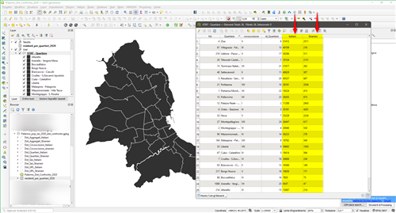

# Mappa One-Person-One-Dot  (una persona un pounto)
"Le mappe di densità dei **punti sono auto-normalizzanti**. Mostrano le densità, il numero di persone che vivono da qualche parte, le diverse nazionalità distribuite in una grande città, il numero di pecore allevate in un paese, ecc... Con le densità dei punti, è possibile superare i maggiori inconvenienti delle mappe coropletiche tradizionali." (Cit.  [John Nelson](https://twitter.com/John_M_Nelson)). 
Una mappa di densità di punti o semplicemente una mappa di punti[^1] è un tipo di mappa tematica che utilizza il simbolo del punto per visualizzare la distribuzione geografica di un gran numero di fenomeni correlati. 
I fenomeni mostrati dalle mappe a densità di punti sono il risultato del lavoro di disposizione di tali punti, si cerca sempre di posizionali con la maggiore precisione possibile, affinché rappresentino l’effettiva distribuzione geografica del fenomeno studiato.

[^1]: Maggiori info su wikipedia [Dot distribution map](https://en.wikipedia.org/wiki/Dot_distribution_map)

---

Nel [2018](https://coseerobe.gbvitrano.it/palermo-popolazione-residente-per-cittadinanza-upl-quartiere-e-circoscrizione-2018.html) l’identificatore geografico più dettagliato nei dati era il blocco (poligono) delle [UPL](https://opendata.comune.palermo.it/opendata-dataset.php?dataset=1219) (Unità di primo livello), di conseguenza, i punti in alcuni blocchi si trovavano in mezzo a parchi, cimiteri, o altre aree chiaramente non residenziali all’interno di quel blocco UPL. 
In quest'ultmio [dataset](https://opendata.comune.palermo.it/opendata-dataset.php?dataset=1304) rilasciato dall'Ufficio Studi e Ricerche Statistiche del Comune di Palermo, l’identificatore geografico più dettagliato nei dati è il blocco delle [zone censuarie dell’ISTAT](https://www.istat.it/it/archivio/104317).  
Adesso che ho rielaborato il **[dataset](https://data.world/gbvitrano/popolazione-residente-a-palermo-2020)** [(scaricabile da data.world)](https://data.world/gbvitrano/popolazione-residente-a-palermo-2020) sulla popolazione straniera residente, posso elaborare una rappresentazione più accurata della distribuzione geografica dei residenti. 
Come base [cartografica](https://coseerobe.gbvitrano.it/circoscrizioni-palermo-censimento-istat-2011.html) uso una rielaborazione dei dati [ISTAT Basi territoriali e variabili censuarie](http://www.istat.it/it/archivio/104317) – Censimento 2011, partendo dalle **sezioni censuarie** ho ricostruito i poligoni delle **Unità di primo livello (UPL)**, **Quartieri** e **Circoscrizioni,**

Visto che abbiamo realizzato un dataset nuovo e dettagliato in modalità **long** con ben 359.101 righe, estratiamo i dati con [VisiData](https://www.visidata.org/) per zona censuaria e li aggreghiamo per italiani e stranieri (file simili sono già presenti anche nel [dataset](https://opendata.comune.palermo.it/opendata-dataset.php?dataset=1304) del Comune), per realizzare alcune mappe di densità       

[Guida italiana di VisiData](https://ondata.github.io/guidaVisiData/)  

---

## Come realizzare la mappa a densità di punti…? 

Ecco un interessante post [One-person-one-dot maps and how to make them](http://www.maartenlambrechts.com/2018/02/13/one-person-one-dot-maps-and-how-to-make-them.html) che ci spiega in modo efficace cosa sono le mappe a densità di punti e come realizzarle con [QGIS](https://www.qgis.org/it/site/).

### Riferimenti
- Video YuoTube [Creating a racial dot density map using QGIS](https://www.youtube.com/watch?v=TOY_7xKtTcU&list=LL&index=1)
- Video YuoTube [Dot density map for race/ethnicity | ArcGis](https://www.youtube.com/watch?v=niiKw2ZtrV0)
- Esempio pratico realizzato con [QGIS](https://www.qgis.org/it/site/), [Milano e Palermo: le mappe della distribuzione della popolazione straniera residente nel 2018](https://coseerobe.gbvitrano.it/milano-e-palermo-le-mappe-della-distribuzione-della-popolazione-straniera-residente-nel-2018.html)

Studiando gli *esempi* replicare la mappa non è impossibile. Gli ingredienti di base sono:

- Dataset ben strutturato di dati statistici;
- Dataset dei poligoni del territorio da analizzare;
- Semplici conoscenze del software [QGIS](https://www.qgis.org/it/site/) o altri software GIS

In sintesi, sono necessari due file:

- uno del territorio che si vuol mappare;
- dati statitici che vogliamo rappresentare di quel territorio.

---

## Mappa a densità di punti con QGIS

### 1️⃣  Punti casuali dentro poligoni

Dopo aver [rielaborato](../../dati/rielaborazione/) il *dataset* per [forma](../../dati/forma/) e/o per [sintesi](../../dati/sintesi/) possiamo finalmente elaborare la nostra mappa con [QGIS](https://www.qgis.org/it/site/).

Per semplicità, realizzeremo la mappa a densità tra residenti *italiani* e *stranieri* nei quartieri di Palermo, per comodità mi sono creato un [Geopackage](https://www.geopackage.org/), dove ho caricato i 2 file necessari al progetto, *ISTAT - Quartiere* (poligoni dei quartieri di Palermo) e *residenti per quartieri 2020* (tabella csv).

[{width="49.65%"} ](../img/qgis_md_01.png "Join realizzata con QGIS")[{width="49.65%"} ](../img/qgis_md_02.png "Nuova tabella dopo la join")

Eseguiamo una Join tra i poligoni (ISTAT - Quartiere) e la tabella che abbiamo preparato in precedenza, usando come campo unione *Id_Quartiere*, selezioniamo solo le colonne utili e lasciamo vuoto il campo del prefisso da utilizzare per le nuove colonne.

Adesso non ci rimane che creare un nuovo layer di **punti casuali**, utilizzando i poligoni dei quartieri, uno per ogni nazionalità, in questo caso, italiani e stranieri.

Aprire il pannello **Strumenti Processing**, dal menù ‘**Processing**’ –> ‘**Strumenti**’,  scrivere nel cerca il nome del comando da eseguire, ‘**Punti casuali dentro poligoni**’, in inglese ‘*Random points in polygons*’ e:

- ➊ Selezionare il vettore d’ingresso, potrebbero esserci più layer di poligoni;
- ➋ Nella riga *Conteggio o densità punti* cliccare sull'icona *Sovrascrittura definita dai dati* , selezionare *Tipo campoint, doppio, stringa*;
- ➌ Selezionare il campo da mappare;
- ➍ Dare un nome al file e specificare il percorso di salvataggio, se lasciato vuoto verrà creato un file temporaneo;
- ➎ Cliccare su esegui, nel giro di pochi secondi il nuovo layer sarà generato.

- ➏ Se dobbiamo ottenere ‘**N**’ layer, uno per ogni sub-regione, per esempio, possiamo eseguire un processo in serie, prima di del punto ➋  clicchiamo su ‘**Esegui come processo in serie**‘ e configuriamo i parametri nella nuova finestra.

La mappa inizia a prendere vita, diminuendo la dimensione dei punti la mappa sarà più leggibile, non ci resta che tematizzare la nostro mappa. 

Abbiamo i punti casuali, ma ancora non ci danno nessuna informazione, i punti sono troppo grandi e si coprono a vicenda. 

Dopo qualche prova, ho impostato i punti in modo da avere una dimensione di **10 Unità Mappa**, ho spento lo stile del contorno, regolato l'opacità al 33% ed ho usato il metodo di fusione "scherma" per rendere i punti sovrapposti più brillanti.

- ➊ Tematizzazione del punto, simbolo semplice, con contorno spento (il punto deve essere rappresentato **SOLO** con la campitura);
- ➋ Regolare l'opacità;
- ➌ Unità di musura del punto;
- ➍ Usare il *metodo di fusione* per rendere i punti sovrapposti più brillanti. 

???+ note

    **10 Unità Mappa** è la dimensione ottimalale per rappresentare i punti a video/web alla *scala* scelta. Va modificata in base alle proprie esigenze.

Ecco le mappe a densità di punti della popolazione residente di Palermo, in **bianco** gli italiani, in **rosso** gli stranieri.

	
<ul>
	<li>
	

 Italiani | 653.570
</li>
<li>
	

 Stranieri | 25.400
</li>
</ul>

---

### 2️⃣  Riempimento simbolo casuale

Sempre con [QGIS](https://www.qgis.org/it/site/) possiamo realizzare velocemente una mappa densità usando la tecnica del **Riempimento simbolo casuale** come spiegato nel canale youtube [cornell-gis](https://www.youtube.com/watch?v=TOY_7xKtTcU&list=LL&index=2)

Dopo aver fatto la *join* tra i dati dei resitenti e i poligoni dei quartieri e senza creare i vari layer per le nazionalità, possiamo mappare i punti utilizzando  la tecnica del **Riempimento simbolo casuale**. 

[{width="49.65%"} ](../img/qgis_md_08.png "Riempimento simbolo casuale Tematizzazione | QGIS")[{width="49.65%"} ](../img/qgis_md_09.png "Riempimento simbolo casuale Tematizzazione | QGIS")

Questa tecnica va bene se voglio velocemente ottenere un mappa a densità, ma a mio avviso presenta diversi liniti.

Pro:

- Ottima tecnica per visualizzare/stampare velocemente una mappa a densità di punti;

Contro:

- Non vengono creati layer con i singoli punti delle varie nazionalità, possono essere utili per realizzare altre mappe e grafici;
- Non possono attivare o disattivare le varie nazionalità, si ha solo una visione d'insieme;
- In fase di stampa o mappa web non c'è una legenda automatica, va creata manualmente;

Personalmente preferisco usare la tecnica dei *Punti casuali dentro poligoni*, s'impiega qualche minuto in più nella '*costruzione*', ma si recupera in fase di editing per la stampa su carta o video. In  più ricavo file e dati che posso riutilizzare con altre applicazioni in qualsiasi momento.

---

## Palermo One-Person-One-Dot

Usando sempre gli stessi dati, aggregandoli e variando di volta in volta il blocco di dettaglio (poligono delle UPL, Quartieri e Circoscrizioni) la posizione dei singoli punti ne è fortemente condizionata, come si può facilmente notare dell'immagine in basso.  

Come già detto in precedenza, e come si nota facilmente dall'imagine, la rappresentazione più realistica della distribuzione dei residenti è stata ottenuta utilizzando come blocco/poligono di riferimento le **sezioni censuarie**.

**Sempre con gli stessi dati, possiamo ottenere una distribuzione ancora più realistica?**

La risposta è **Si**

Nel 2021 la Presidenza del Consiglio dei Ministri – Dipartimento della Protezione Civile ha pubblicato su [Github](https://github.com/pcm-dpc) il dataset nazionale degli aggregati strutturali, una raccolta dati sugli aggregati edilizi del nostro Paese. 
Qualche giorno dopo il rilasdcio degli aggregati edilizi, con [Totò Fiandaca](https://twitter.com/totofiandaca) abbiamo [rialaborato](https://coseerobe.gbvitrano.it/dpc-aggregati-strutturali-itg-palermo.html) gli aggregati del Comune di Palermo. Abbiamo aggiunto ai poligoni degli aggregati le informazioni delle **Unità di primo livello (UPL)**, **Quartieri** e **Circoscrizioni,**.  
Usando adesso come base cartografica, la nostra rielaborazione degli aggregati edilizi, otteniamo una distribuzione ancor più accurata.

Distribuzione geografica per tipologie di Aree in dettaglio.

Utilizzando gli aggregati edilizzi come identificatore geografico, la mappa a densità è molto più accurata, la distribuzione geografica infatti è all'interno degli isolati (aggregati edilizi) e **NON** *anche* in strade, giardini, parchi ecc... come avviene usando i poligono delle Circoscrizioni, Quartieri, UPL e sezioni censuarie.

!!! note

		La geolocalizzazione dei punti **non rappresenta l'indirizzo reale**. 

Volendo esagerare si potrebbe usare il dataset [CARTA TECNICA COMUNALE - UNITA' VOLUMETRICHE](https://opendata.comune.palermo.it/opendata-dataset.php?dataset=1294) 🙂 