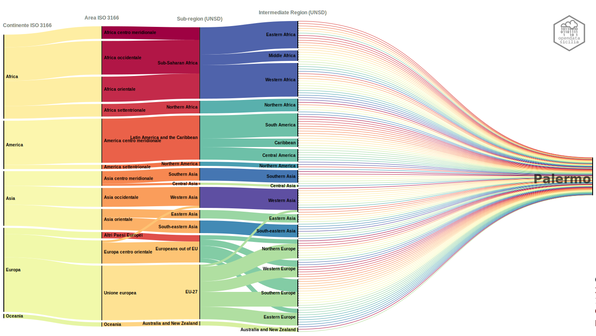

# Paese di provenienza

I cittadini stranieri, comunitari e non, residenti a Palermo nel 2020  sono **25.400** arrivano da 5 [Continenti](https://it.wikipedia.org/wiki/Continente) e rappresentano  **130** [Nazioni](https://it.wikipedia.org/wiki/Geoschema_delle_Nazioni_Unite), cosi suddivise:

- Africa	**40**	
- America	**23**	
- Asia		**26**	
- Europa	**39**	
- Oceania	**2**	

oggi sono il **3,89%** della popolazione totale (653.715).

## World Map
<body> 

<object class='tableauViz'  style='display:none;'><param name='host_url' value='https%3A%2F%2Fpublic.tableau.com%2F' /> <param name='embed_code_version' value='3' /> <param name='site_root' value='' /><param name='name' value='Stranieri_2020_Continenti&#47;World__Palermo' /><param name='tabs' value='no' /><param name='toolbar' value='yes' /><param name='animate_transition' value='yes' /><param name='display_static_image' value='yes' /><param name='display_spinner' value='yes' /><param name='display_overlay' value='yes' /><param name='display_count' value='yes' /><param name='language' value='it-IT' /><param name='filter' value='publish=yes' /></object>
                

</body> 
## Sankey diagram
<body> 

</body> 
<figure markdown>

  <figcaption>Palermo | 130 nazionalità rappresentate nel 2020</figcaption>
</figure>

---

Cittadini stranieri residenti per Area Geopolitica/[Sub-region](https://it.wikipedia.org/wiki/Geoschema_delle_Nazioni_Unite) secondo il geoschema delle Nazione Unite (UNSD)

- Africa: **8.046** *(31,68%)*
	- Northern Africa - 2193
	- Sub-Saharan Africa - 5853
- America: **791** *(3,11%)*
	- Latin America and the Caribbean - 733
	- Northern America - 58
- Asia: **11.743** *(46,23%)*
	- Eastern Asia - 1008
	- South-eastern Asia - 1797
	- Southern Asia - 8812
	- Western Asia - 112
	- Central Asia - 4
- Europa: **4.745** *(18,68%)*
	- EU-27 - 4057
	- Europeans out of EU - 688
- Oceania: **9** *(0,04%)*
	- Australia and New Zealand - 9
	
Per un tolale di **25.242** che aggiunti agli [Apolidi](https://it.wikipedia.org/wiki/Apolidia) e ad altri cittadini a cui non è sto possibile attribuire una nazionalità si arriva ad un totale di **25.400** cittadini stranieri residenti.

## Hierarchy Circles
<body> 

</body> 

Il **46,23** proviene da Paesi asiatici, il **31,68%** da Paesi africani, il **18,68%** proviene da Paesi europei, il **3,11%** sono di provenienza americana, e solo 0,04% provengono dall’Oceania. Gli Apolidi sono lo **0,03%** ed i cittadini a cui non è stato possibile assegnare una nazionalità sono lo **0,23%**