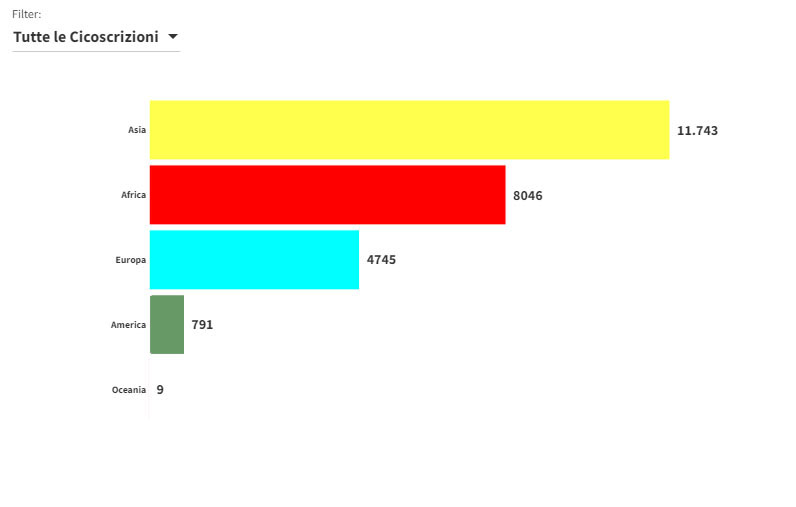
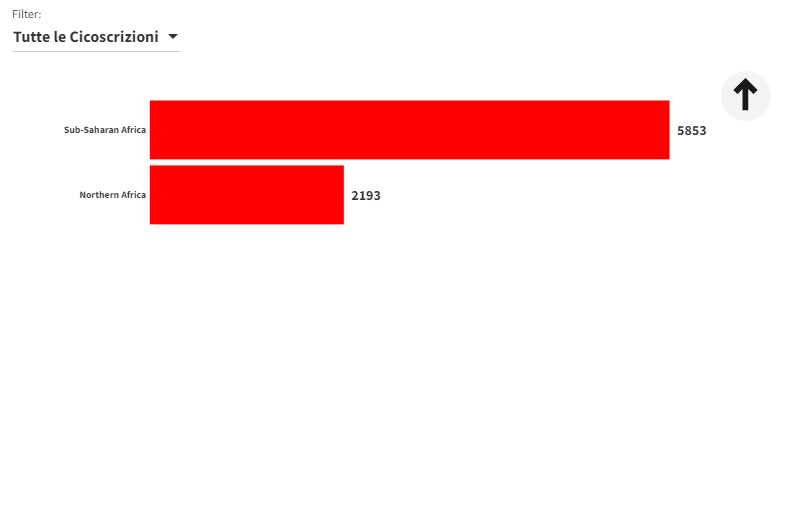
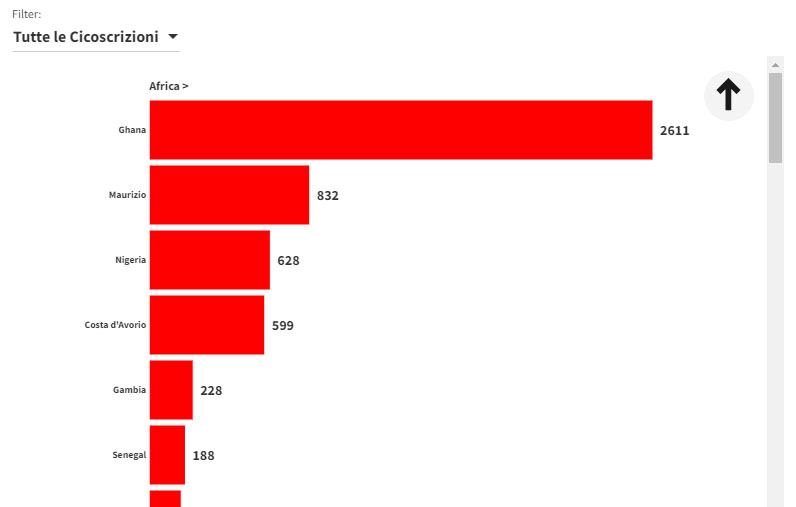
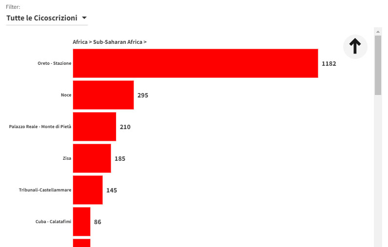

# Quanti sono?

I cittadini stranieri, comunitari e non, residenti a Palermo nel 2020  sono **25.400** rappresentano  **130** [Nazioni](https://it.wikipedia.org/wiki/Geoschema_delle_Nazioni_Unite) provenienti da 5 [Continenti](https://it.wikipedia.org/wiki/Continente), oggi sono il **3,89%** della popolazione totale (653.715).

- Asia: **11.743** *(46,23%)*
- Africa: **8.046** *(31,68%)*
- Europa: **4.745** *(18,68%)*
- America: **791** *(3,11%)*
- Oceania: **9** *(0,04%)*

## Hierarchy Bar
<body> 

</body> 

!!! note
	Il dataviz in alto, visualizza in 4 liveli i cittadini stranieri residenti nelle Circostrizioni:

	- Continenti;
	- Aree Geopolitica del Continente selezionato, (Sub-Region);
	- Nazioni della Sub-Region selezionata;
	- Quartieri in cui i cittadini della Nazione selezionata risiedono.

{width="24.65%"} {width="24.65%"} {width="24.65%"} {width="24.65%"}

---

## Tabella dati
<body> 

<object class='tableauViz'  style='display:none;'><param name='host_url' value='https%3A%2F%2Fpublic.tableau.com%2F' /> <param name='embed_code_version' value='3' /> <param name='site_root' value='' /><param name='name' value='Palermo_residenti_stranieri_2020_geoschema&#47;Geoschema' /><param name='tabs' value='no' /><param name='toolbar' value='yes' /><param name='animate_transition' value='yes' /><param name='display_static_image' value='yes' /><param name='display_spinner' value='yes' /><param name='display_overlay' value='yes' /><param name='display_count' value='yes' /><param name='language' value='it-IT' /><param name='filter' value='publish=yes' /></object>
                
</body> 

