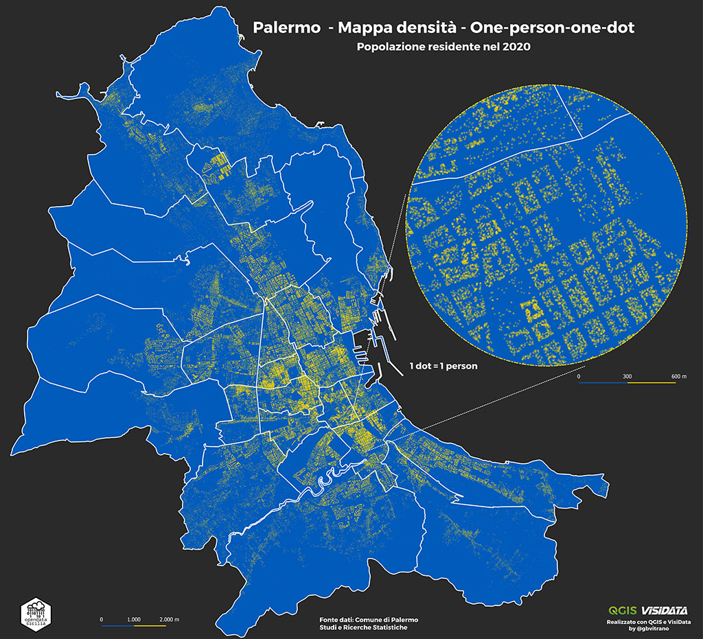

# Da dove vengono gli stranieri che vivono a Palermo?

Gli stranieri residenti a Palermo nel 2020 sono **25.400** e rappresentano **130** [Nazionalità](https://it.wikipedia.org/wiki/Geoschema_delle_Nazioni_Unite#Asia_occidentale_(Western_Asia)) provenienti da 5 [Continenti](https://it.wikipedia.org/wiki/Continente), oggi sono il **3,89%** della popolazione totale (653.570) e lo 0.7% del totale nazionale, dato che colloca Palermo in **decima posizione** tra le 14 Città metropolitane per numero di residenti stranieri regolari. 

- [Da dove arrivano?](dove/provenienza/)
- [Quanti sono?](dove/quanti/)
- [Dove vivono?](dove/dove_vivono/)
- [Chi sono?](dove/chi)
- [Qual è il rapporto stranieri/italiani nel territorio?](rapporto/rapporto/)

---

One-Person-One-Dot [Distribuzione geografica della popolazione residente per quartiere](dove/one-person-one-dot/).

<figure markdown>

<figcaption>Popolazione residente nel 2020 | by @opendatasicilia</figcaption>
</figure>

<body>
 

 

 &nbsp;&nbsp;&nbsp;&nbsp;&nbsp;&nbsp;
   

   </body>